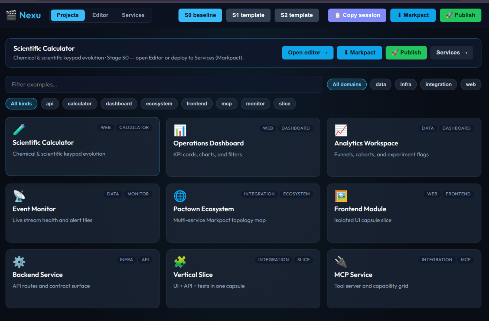
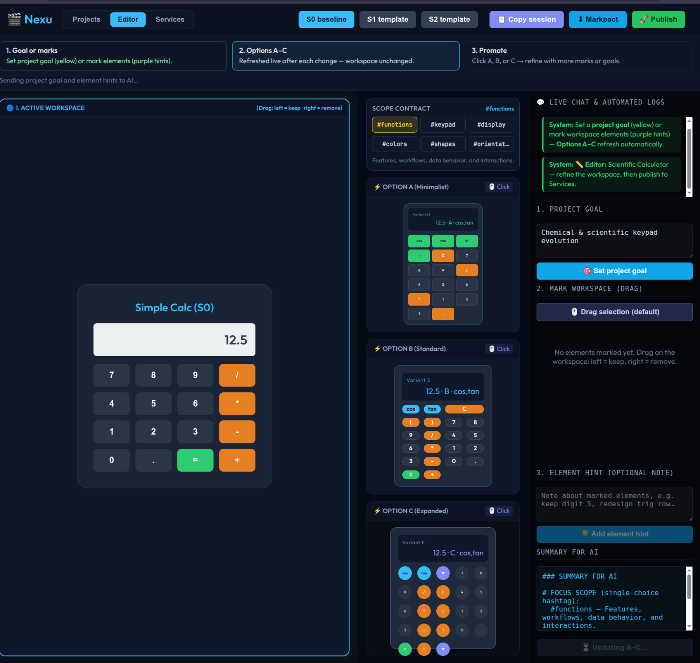

# Nexu

Projects


Evolution in scope: functions


## AI Cost Tracking

   
  

- 🤖 **LLM usage:** $10.1205 (62 commits)
- 👤 **Human dev:** ~$3015 (30.2h @ $100/h, 30min dedup)

Generated on 2026-07-05 using [openrouter/deep/deep-v4-pro](https://openrouter.ai/deep/deep-v4-pro)

---

**Nexu** is a **Visual Intent Contract Orchestrator** for controlled code and UI evolution.

It helps you take a large project, freeze its current state, extract a small isolated slice called a
capsule, evolve that capsule through human or LLM-assisted iterations, verify the result against
intent contracts, and only then promote the changes back into the source project.

```text
init -> freeze -> capsule create -> plan/blueprint -> iterate -> verify -> review -> promote
```

Nexu is useful when a task is too risky or too broad for direct edits in the main workspace. Instead
of asking an LLM to operate on the whole repository, Nexu gives it a smaller, versioned sandbox with
explicit files, contracts, evidence, reports and promotion checks.

## Current State

Current release: **0.5.17**.

The project currently provides:

- a Typer-based CLI: `nexu init`, `nexu freeze`, `nexu capsule ...`, `nexu mcp ...`,
- project snapshots with lightweight file-hash baselines,
- isolated capsules under `.nexu/capsules/<name>/`,
- deterministic capsule planning and iteration folders,
- UI/API/test blueprints generated from capsule metadata and Intract contracts,
- static runtime previews for capsules,
- LLM-ready prompt export with hard capsule boundaries,
- verification reports with contract, drift and evidence checks,
- human/LLM review packets and portable review bundles,
- dry-run and apply promotion modes,
- MCP-compatible stdio tools for IDE/agent clients,
- Cinema: an interactive browser workspace for visual UI evolution,
- local quality profile using pytest, Markdown link checks, Intract, redup and ruff.

Network LLM calls are disabled by default. They are only used when enabled in `nexu.yaml` and when
the required API key environment variable is present.

## Installation

From PyPI:

```bash
python -m venv .venv
. .venv/bin/activate
pip install nexu
nexu --help
```

For local development:

```bash
git clone https://github.com/semcod/nexu.git
cd nexu
python -m venv .venv
. .venv/bin/activate
pip install -e .[dev]
python -m nexu --help
```

Nexu requires Python **3.10+**.

## What Nexu Creates

After `nexu init .`, a project gets:

```text
nexu.yaml      project configuration
intract.yaml   project-level intent contracts
.nexu/         local Nexu state
```

A capsule stores its own metadata, copied source slice, baseline hashes, contracts, plans, reports
and generated artifacts:

```text
.nexu/capsules/<name>/
  capsule.yaml
  intract.yaml
  src/
  iterations/
  baseline/
  plan/
  blueprints/
  runtime/
  evidence/
  reviews/
  reports/
  bundles/
  cinema/
```

## Quick Start

```bash
nexu init .
nexu freeze . --name baseline

nexu capsule create . \
  --name users-api \
  --domain backend \
  --include "src/users/**" \
  --endpoint "POST:/api/users"

nexu capsule plan users-api --steps 5 --goal "Improve create-user flow" --print
nexu capsule blueprint users-api --print
nexu capsule iterate users-api --steps 3 --goal "Improve create-user flow"
nexu capsule export-prompt users-api
nexu capsule verify users-api
nexu capsule review users-api
nexu capsule report users-api
nexu capsule promote users-api --dry-run
```

When the promotion plan is acceptable and verification is clean:

```bash
nexu capsule promote users-api --apply
```

## Main Commands

Project setup:

```bash
nexu init .
nexu freeze . --name baseline
```

Capsule lifecycle:

```bash
nexu capsule create . --name my-slice --include "src/my_module/**"
nexu capsule list
nexu capsule status my-slice
nexu capsule plan my-slice --steps 10 --goal "Evolve the selected workflow"
nexu capsule blueprint my-slice --print
nexu capsule iterate my-slice --steps 3 --goal "Evolve the selected workflow"
nexu capsule runtime my-slice
nexu capsule export-prompt my-slice
nexu capsule diff my-slice
nexu capsule drift my-slice
nexu capsule verify my-slice
nexu capsule journal my-slice
nexu capsule review my-slice
nexu capsule bundle my-slice
nexu capsule report my-slice
nexu capsule promote my-slice --dry-run
nexu capsule promote my-slice --apply
```

MCP integration:

```bash
nexu mcp tools
nexu mcp serve --path .
```

Use `python -m nexu ...` instead of `nexu ...` when running directly from an editable checkout
without installing the console script.

## Typical Workflows

### Human-controlled refactor

1. Freeze the project with `nexu freeze`.
2. Create a capsule containing only the files relevant to the change.
3. Edit files inside `.nexu/capsules/<name>/src/`.
4. Run `nexu capsule verify <name>`.
5. Review `nexu capsule diff <name>` and `nexu capsule report <name>`.
6. Promote with `--dry-run` first, then `--apply` after review.

### LLM-assisted implementation

1. Create a capsule and run `nexu capsule blueprint`.
2. Export a constrained prompt with `nexu capsule export-prompt`.
3. Give the prompt to an IDE agent or external LLM.
4. Keep the agent working only inside the capsule.
5. Verify, review and promote through Nexu.

### IDE agent integration

Run the MCP stdio server:

```bash
nexu mcp serve --path .
```

The MCP service exposes conservative tools for capsule creation, status, planning, blueprinting,
iteration, prompt export, runtime generation, verification, review, reports and promotion planning.

## Cinema: Visual UI Evolution

Cinema is Nexu's browser-based UI evolution mode. It generates a local player for a capsule with:

- one active workspace frame,
- three option frames for alternative UI proposals,
- visual selection and keep/remove marking,
- a policy ledger backed by Intract-style constraints,
- restoreable UI history checkpoints,
- local service publishing for selected stages,
- Markpact export for portable handoff.

Run the default calculator Cinema example:

```bash
make cinema
```

Open the URL printed by the command. Do not assume a fixed port.

### Switching example projects in the player

The Cinema server runs inside one workspace capsule (for example `scientific_calc`), but the
player can load any catalog project (calculator, dashboard, `backend_service`, analytics, …)
without restarting the server:

1. Open the **Projects** tab and pick a card, or use a deep link:
   `http://127.0.0.1:<port>/cinema_player.html?project=backend_service`
2. Activation resets the policy ledger for the previous example, seeds goal contracts from the
   project subtitle, and rebuilds **distinct** Options A–C from that project's stages.
   In the activation response, `goal_bootstrap.status` is `requires_llm` (goal contracts are ready,
   option generation is deferred to the LLM iteration step).
3. Mark elements on the **workspace** frame (drag or review mode), then iterate or promote.

**Import your own project:** on the **Projects** tab use **Upload ZIP**, **Git URL**, or
**HTTP website**. Each import is converted to a Markpact migration README locally, seeded
into stage0–2, and appears in the project catalog. **HTTP imports** show the fetched page
in stage0 (with a `<base href>` to the live site and optional local CSS); stage1–2 remain
the Markpact migration workspace. Re-select the project in the catalog to refresh stage0
from stored source without re-fetching. Refine in the Editor, then use
**⬇ Markpact** or **🚀 Publish** to deploy. HTTP import requires
`llm.allow_network_calls: true` in workspace `nexu.yaml`.

**Scope routing:** visual scopes (`#colors`, `#shapes`, `#display`, `#orientation`, calculator
`#keypad`) refresh Options A–C via the offline fast path or cache when possible. `#functions`
always uses the LLM — enable network calls and an API key in workspace `nexu.yaml` for that
scope.

The Intract panel shows **Active example (Cinema UI)** separately from the frozen capsule
baseline (`calc.*` contracts stay tied to the workspace capsule).

Useful commands:

```bash
make cinema-open
make cinema-stop
make cinema-restart
make cinema-repair
NEXU_CINEMA_NO_OPEN=1 make cinema
```

Override the capsule, workspace path or model:

```bash
make cinema \
  CINEMA_CAPSULE=scientific_calc \
  CINEMA_PATH=examples/web_app_calculator/workspace \
  CINEMA_GOAL="Convert the calculator into a scientific calculator"

make cinema CINEMA_MODEL=openrouter/google/gemini-3.1-flash-lite-preview
```

To allow real LLM calls, add an API key and enable network calls in the workspace config:

```bash
OPENROUTER_API_KEY=...
```

```yaml
llm:
  provider: openrouter
  model: openrouter/deepseek/deepseek-v4-pro
  base_url: https://openrouter.ai/api/v1
  allow_network_calls: true
  api_key_env: OPENROUTER_API_KEY
```

## Examples

Smoke-tested examples:

```bash
python examples/run_examples.py
```

Direct UI examples:

```bash
python examples/web_app_calculator/run.py
python examples/web_app_dashboard/run.py
```

Additional examples:

- [Frontend view](examples/frontend_view/README.md)
- [Backend service](examples/backend_service/README.md)
- [Vertical slice](examples/vertical_slice/README.md)
- [Calculator UI evolution](examples/web_app_calculator/README.md)
- [Dashboard UI evolution](examples/web_app_dashboard/README.md)
- [Analytics dashboard evolution](examples/web_app_analytics/README.md)
- [Pactown ecosystem integration](examples/web_app_pactown_ecosystem/run.py)
- [Event monitor integration](examples/web_app_event_monitor/run.py)
- [Realtime OpenRouter lane sync](examples/realtime_lane_nexu_sync.py)

Pactown examples require `uv`, `pactown` and free local ports:

```bash
python examples/web_app_pactown_ecosystem/run.py
python examples/web_app_event_monitor/run.py
docker compose -f examples/web_app_event_monitor/docker/docker-compose.yml config --quiet
```

## Quality Checks

Fast project profile:

```bash
make quality
```

It runs:

- `pytest -q`,
- local Markdown link validation,
- `intract check src`,
- `intract coverage src`,
- `redup scan src`,
- the currently clean ruff subset.

Other useful checks:

```bash
make test
make examples
make docs-links
make quality-strict
make ci-cinema-smoke
```

`quality-strict` is intentionally broader and may be more useful as a backlog report than as a
release gate.

## Documentation

Start here:

- [Docs index](docs/README.md)
- [Getting started](docs/getting-started.md)
- [Commands](docs/commands.md)
- [Architecture](docs/architecture.md)
- [Capsule format](docs/capsule-format.md)
- [Intent contracts](docs/intent-contracts.md)
- [Verification model](docs/verification.md)
- [Runtime and reports](docs/runtime-and-reports.md)
- [LLM review and handoff](docs/llm-review.md)
- [LLM orchestration](docs/llm-orchestration.md)
- [MCP service](docs/mcp-service.md)
- [Examples](docs/examples.md)
- [Roadmap](docs/roadmap.md)

## Important Project Paths

```text
src/nexu/                       Python package
src/nexu/templates/cinema/      packaged Cinema templates
docs/                           documentation
examples/                       runnable examples
scripts/check-doc-links.py      local Markdown link validator
tests/                          unit tests
pyqual.yaml                     declarative quality profile
Makefile                        local development commands
```

The default `make quality` profile already uses `intract` and `redup`.

## Repatch: Real-Time Live UI Evolution (MCP + WebSockets)

Nexu integrates with the **Repatch** package to enable an evolutionary approach to frontend development. Rather than traditional full-page generation and browser reloads, Repatch treats the running page as a **continuous live target** that is mutated in-place via a lightweight WebSocket/SSE streaming protocol.

### Repatch SDK (`./sdk/js/`)
A pure-JavaScript client-side SDK (`repatch-sdk.js`) connects to the local patch server and parses the surgical **Repatch DSL**:
- `ADD <selector> <html_content>`: Appends a child element dynamically.
- `REPLACE <selector> <html_content>`: Replaces the inner HTML of a targeted selector.
- `STYLE <selector> { css_rules }`: Applies visual style updates to targets in real time.
- `REMOVE <selector>`: Surgically deletes elements from the page.

### Live Evolution Demo (`./examples/mcp_patch_demo/`)
A premium glassmorphic live preview dashboard:
- Mounts the local Repatch JS SDK.
- Streams live UI mutations via a Node.js WebSocket server.
- Displays an interactive virtual terminal log of received DSL patches.
- To run, execute: `cd examples/mcp_patch_demo && npm install && npm start`.

---

## Dual-Mode Intract Support

Intent verification via **Intract** now supports two powerful operation modes:
1. **Inline Comments (Directly in Code):** Place `@intract.v1` rules directly preceding the classes, functions, or blocks they govern inside source files.
2. **Standalone Manifest (`intract.toon.yaml`):** An external manifest allowing precise target coordinate addressing:
   - **`target.file`**: Target file path.
   - **`target.function`**: Target function name.
   - **`target.line`**: Target code line number.
   - **`target.xpath` / `xpatch`**: Target HTML/XML nodes via XPath.

Example `intract.toon.yaml`:
```yaml
contracts:
  - id: forbid-destructive-updates
    intent: ensure-no-write
    forbid: [destructive_write, write]
    target:
      file: "src/calculator.py"
      function: "add_numbers"
      line: 45
  - id: button-style-check
    intent: validate-element-style
    validate: [contrast_ratio]
    target:
      file: "index.html"
      xpath: "//button[@id='btn-eq']"
```

## License

Licensed under Apache-2.0.
