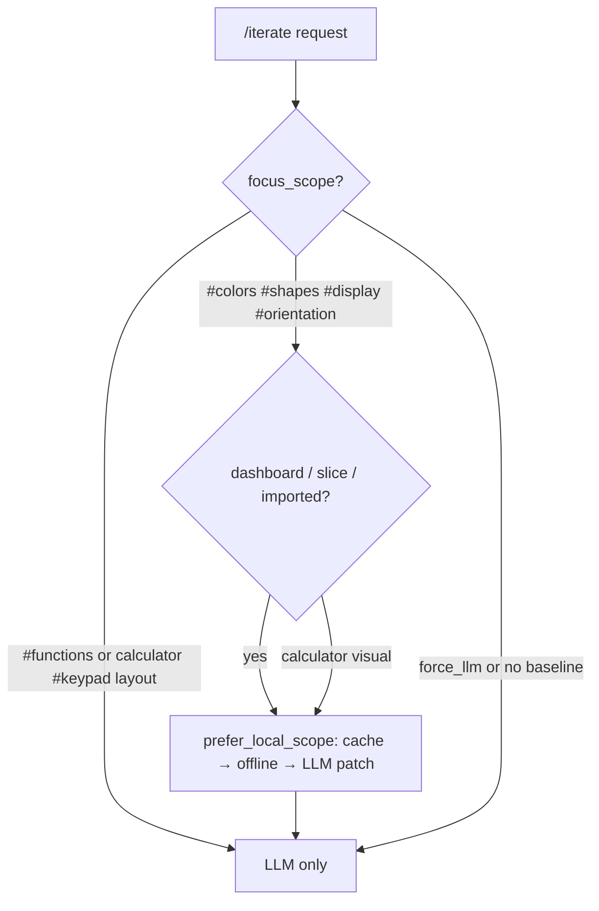

# Cinema `/iterate` optimizations

Tracking UX, performance, and routing improvements for the Cinema player and server
(`/iterate` pipeline: cache -> LLM patch -> offline fast path -> LLM batch/parallel).

For **limitations**, **recovery**, and **open improvements** (not the done-items table), see
[cinema-limitations-and-improvements.md](cinema-limitations-and-improvements.md).

| Priority | Item | Status | Notes |
|----------|------|--------|-------|
| **Performance** | | | |
| P1 | Options cache for goal_options (`cinema_options_cache.py`) | done | Keyed by stage HTML, ledger, scope, goal, marks |
| P1 | Offline fast path for visual scopes (`cinema_offline_options` + `inject_scope_style`) | done | ~10–50 ms; colors/shapes/display/orientation/keypad |
| P1 | LLM CSS patch path for visual scopes (`repatch.ui_patch`) | done | JSON/CSS A-C patches before full HTML generation |
| P1 | Fast delivery package (`nexu.fast_delivery`) | done | Shared routing/context primitives for quick improvement loops |
| P1 | Fast delivery option cache helpers | done | `read_cached_options`, `store_options_cache`, `read_option_files` |
| P1 | LLM batch / parallel option generation | done | `OPTION_GENERATION_MODE`; ThreadPoolExecutor fallback |
| P1 | LLM HTML structure validate/repair (`cinema_html_validate.py`) | done | Repair head/style placement; reject invalid calculator DOM before serve |
| **Routing / docs** | | | |
| P0 | Scope routing: `#functions` / `#keypad` (dashboard) → LLM only | done | `scope_supports_offline_fast_path` |
| P0 | Visual scopes → offline / cache before LLM | done | Verified in `test_iterate_colors_scope_uses_offline_path` |
| P1 | README note: visual scopes = offline; `#functions` = LLM | done | Cinema section in root README |
| **UX** | | | |
| P1 | Projects tab import (ZIP / Git / HTTP → Markpact) | done | `cinema_project_imports.py`; `/projects/import/*`; local `imported_projects/` |
| P1 | HTTP import stage0 preview (base href + local CSS) | done | Fetched HTML in workspace iframe; Markpact README stays metadata |
| P1 | HTTP import preprocess (visual CSS + HTML outline) | done | `cinema_http_preprocess.py`; `source/nexu-visual.css`, `source/nexu-outline.html`; `llm_context_mode: patch` |
| P1 | Catalog/example seed preprocess on activation | done | `preprocess_cinema_seed`; `nexu-visual.css` + `nexu-outline.html` beside `stage0.html`; `active_project.json` patch mode |
| P1 | HTTP import preview shield + marking selectors | done | `inject_cinema_shield` + `SELECTOR_HTTP` in `cinema_scripts.py`; preview shim preserved |
| P1 | Marked-element LLM context (fragment iteration) | done | `cinema_marked_context.py`; `/iterate` prefers marked HTML/CSS over full page or scope block |
| P0 | Goal modal on Editor activate only | done | Player skips auto-iterate when `goal_options_seeded`; Editor button opens goal flow |
| P1 | Dashboard/slice offline-first routing | done | `prefer_local_scope` uses `DASHBOARD_KINDS` before LLM patch in `/iterate` |
| P1 | HTTP import options/policy decoupled from calculator | done | stage0 clones to A–C; ledger reset; `is_calculator: false` in policy snapshot |
| P0 | `focus_scope` on `lastIteration` + `/iterate` JSON response | done | Player export + server response |
| P1 | Clearer player message when `llm_failed` on `#functions` | done | Points to nexu.yaml LLM config or visual scopes |
| P2 | Skip offline fast path when no stage HTML baseline | done | `cinema_has_offline_baseline` in server `_try_intract_fast_options` |
| **Projects without seed** | | | |
| P2 | Guard offline path when `stage0.html` missing or too small | done | Falls through to LLM (or `llm_failed` if network off) |
| P2 | Import ZIP / Git / HTTP → Markpact migration in Projects tab | done | `cinema_project_imports.py` + `/projects/import/*` |
| P3 | Rich seed HTML for monitor/api/mcp/slice catalog projects | deferred | `_seed_html_for_project` covers activation; bespoke per-project cinema assets out of scope |
| **Refactor (2026-05)** | | | |
| R1 | Consolidate UI profile + offline eligibility in `cinema_scope.py` | done | `load_cinema_ui_profile`, `can_use_offline_fast_iterate` |
| R2 | Extract `/iterate` JSON payload builder | done | `cinema_iterate.build_iterate_response_payload` |
| R3 | Deduplicate active-project reads in offline path | done | `cinema_offline_options` uses `load_active_project` + `DASHBOARD_KINDS` |
| R4 | Thin generated `server.py` (remove inline `_DASHBOARD_KINDS`) | done | Template delegates to shared modules |

## Scope routing (reference)



| Route | Scopes | Order |
|-------|--------|-------|
| LLM only | `#functions` (all kinds); calculator `#keypad` layout changes | LLM |
| Offline-first | `#colors`, `#shapes`, `#display`, `#orientation`; dashboard/slice/imported visual scopes | cache → offline (~10–50 ms) → LLM CSS patch → full LLM |
| Patch context | HTTP imports + catalog seeds with preprocess artifacts | compact `nexu-visual.css` + `nexu-outline.html` instead of full `stage0.html` |

- **LLM only:** `#functions` (all kinds); `#keypad` on calculator when changing control layout.
- **Cache / LLM patch / offline first:** `#colors`, `#shapes`, `#display`, `#orientation`; calculator `#keypad` for palette/geometry patches.
- Override: `cinema.force_llm: true` skips offline; `cinema.fast_scope_options: false` disables the local fast path; `cinema.llm_patch_options: false` disables the compact LLM CSS patch path.

## Marked-element fragment iteration (2026-06)

Patch primitives (`marked_context`, `scope`, `ui_patch`, `spatial`, `dom_patch`) live in the standalone [`repatch`](../../repatch) package; Nexu imports them via a path dependency.

When the player sends KEEP/DELETE marks (`annotations` + optional `selected_fragments` from the shield iframe):

1. **Player:** left-click/drag = KEEP (green), right-click/drag = DELETE (red). Each mark triggers `scheduleAutoIteration('mark')` with a shorter debounce (`FRAGMENT_ITERATE_MS`). Marks can start iteration even when a project goal is still pending.
2. **Server:** `resolve_marked_llm_context` extracts each marked element's HTML subtree plus CSS rules matching its id/classes. When `llm_context_mode: patch`, visual CSS from `nexu-visual.css` is filtered to marked selectors; client-side fragments fill gaps when HTTP preview selectors miss an element.
3. **Prompt precedence:** marked context overrides scoped page fragments and full-page patch context for both full LLM and LLM CSS patch paths. When marks exist on imported/web/dashboard projects, full-page LLM generation is blocked (`should_block_full_html_iterate`); routes fall through to offline scope CSS, LLM CSS patch, or local `#functions` DOM patch (`cinema_dom_patch.py`).
4. **Scope semantics:**
   - **KEEP (green):** element stays as-is in Options A–C (visual scopes skip global CSS when only KEEP marks are present; offline CSS is scoped to DELETE targets only).
   - **DELETE (red):** scope-dependent change — `#functions` removes/redesigns DOM; `#colors` / `#shapes` / `#display` / `#orientation` restyle marked fragments only (no spatial delete on visual scopes).
5. **Scope availability:** `cinema_scope.SCOPE_IDS_BY_KIND` — calculator adds `#keypad`; dashboard/slice/imported/web share `#functions` + visual layers; api/mcp omit `#orientation`. Player `allowedScopeIdsForKind` mirrors this set.
6. **Scope-isolated marks:** KEEP/DELETE overlays and ledger entries are keyed by `focus_scope`; switching scope clears the UI for scopes without marks; returning restores from `scopedAnnotations` or ledger (`GET /policy?focus_scope=…`). Unscoped legacy ledger rows do not apply when a scope filter is active.

Re-run `make cinema-restart` after template changes so generated `server.py` picks up the routing.

## semcod/wronai fit check

Existing tools are useful, but none should replace the local Nexu fast path yet:

| Tool | Useful part | Nexu decision |
|------|-------------|---------------|
| `semcod/proxym` | Semantic LLM cache, routing, budget/fallback chains | Good future backend for model routing; Nexu still needs local per-stage option routing |
| `semcod/prellm` | Small-model preprocessing and context reduction | Good future preprocessor for large refactors; Nexu first extracts deterministic context compaction |
| `semcod/planfile` | Long SDLC loop, tests, fix/retest automation | Complementary for repo-wide delivery, too broad for per-click Cinema latency |
| `wronai/markpact` | Executable project contract | Already aligned with Nexu Markpact export/import |
| `wronai/curllm` | Browser/visual automation with dynamic selectors | Candidate for future UI validation, not option generation routing |

`nexu.fast_delivery` is therefore a small internal package, not a competing external product:
it owns the low-latency route choice and context trimming for the Cinema improvement loop.
The package now also owns the common option-cache read/store operations so generated
Cinema servers only pass local paths/configuration into tested library functions.

## Config (`nexu.yaml`)

```yaml
cinema:
  force_llm: false
  fast_scope_options: true
  llm_patch_options: true
  options_cache: true
```

## Verification (2026-05-31)

| Check | Result |
|-------|--------|
| `pytest -q` | 156 passed |
| `make quality` | OK (156 pytest + docs links + intract + redup + ruff, 0 duplicate groups) |
| Template ↔ example sync (`cinema_player.html.tmpl` vs calculator example) | identical |
| `/iterate` offline path (colors scope, no LLM) | `test_iterate_colors_scope_uses_offline_path` + cache re-hit |
| LLM HTML validate/repair before option serve | `tests/test_cinema_html_validate.py`, `tests/test_cinema_llm.py` |
| `/iterate` without `stage0.html` baseline | `test_iterate_colors_without_stage0_skips_offline` |
| `/iterate` `#functions` with network off | `test_iterate_functions_scope_skips_offline_fast_path` |
| `build_iterate_response_payload` shape | `tests/test_cinema_iterate.py` |
| Project activation seed (no bespoke cinema assets) | `tests/test_cinema_projects.py` + smoke script |

## Pozostałe / Remaining

### Must-do refactor (this session)

- [x] **R1** — `load_cinema_ui_profile` + `can_use_offline_fast_iterate` in `cinema_scope.py`
- [x] **R2** — `build_iterate_response_payload` in `cinema_iterate.py`
- [x] **R3** — offline options use `load_active_project` instead of local JSON reader
- [x] **R4** — server template delegates profile/eligibility/response to shared modules

### Nice-to-have (still open)

- [ ] Extract more `/iterate` orchestration from `server.py.tmpl` into testable Python (cache read/write, LLM batch wiring) — template remains ~2300 lines
- [x] Wire `repatch.ui_patch` LLM CSS patch workflow before offline/full HTML fallback
- [x] Extract `nexu.fast_delivery` package for context compaction and ready-status routing
- [x] Move option cache read/store/apply helpers into `nexu.fast_delivery.options`
- [x] Extract shared HTML document closure helper to remove duplicate validation/LLM code
- [ ] Share `_effective_markpact_mode` fallback scope set with `offline_fast_scopes_for_kind` (minor duplication in template exception handler)
- [ ] Align `examples/*/cinema/server.py` only when checked in; runtime regenerates from template on `sync_cinema_templates` / server start
- [ ] Broader type hints on generated-server helper signatures (low priority)

### Deferred (P3)

- [ ] **P3** — Rich seed HTML / bespoke cinema assets per catalog project (monitor, api, mcp, slice)
- [ ] Per-project offline CSS beyond generic dashboard/calculator shells in `inject_scope_style`

### Manual smoke (optional)

- `make cinema-stop && make cinema` — visual scopes (`#colors`, `#display`, …) work offline; `#functions` needs LLM key in workspace `.env` / `nexu.yaml`

## HTTP import preview

When you import a website via **HTTP URL**, Nexu:

1. Fetches the page (follows redirects, stores `final_url` and charset in `source/nexu-fetch-meta.json`).
2. Optionally downloads up to five same-origin stylesheets into `source/assets/` and rewrites `<link>` tags to local cinema paths.
3. **Preprocesses** the snapshot into compact LLM artifacts: `source/nexu-visual.css` (colors/shapes/layout tokens, capped at 64KB) and `source/nexu-outline.html` (DOM skeleton without script/text bloat). `project.json` records `llm_context_mode: "patch"`, byte counts, and node count.
4. Seeds **stage0** (and Options A–C) with the fetched HTML plus a `<base href="…">` pointing at the live origin so images and remaining assets load from the source site.
5. Keeps **stage1/stage2** as the Markpact migration dashboard and still writes `README.markpact.md`.
6. Resets the policy ledger and rebuilds `intract_policy.json` with `is_calculator: false` so calculator KEEP/DELETE marks do not bleed into imported iterations.

**LLM iteration:** when an HTTP import is active, `/iterate` and the LLM CSS patch path prefer `nexu-visual.css` + `nexu-outline.html` over full `stage0.html`. Prompts instruct the model to patch CSS values and minimal HTML attributes — not regenerate the whole document.

**Re-activate** an existing HTTP import from the Projects tab to rebuild stage0 and Options A–C from stored `source/index.html` without re-fetching. If you iterated before this fix, delete stale `alt_*.html` or re-activate to replace calculator pollution. **Re-import** after `make cinema-restart` to generate preprocess artifacts for imports created before this feature.

## Pre-import HTML organize (2026-06)

Before HTTP preprocess (or Markpact migration for ZIP/git), `_maybe_organize_import_source` runs `repatch.organize_html_project_dir` when `source/index.html` exists:

1. Extracts substantial inline `<style>` / `<script>` to `nexu-extracted.css` / `nexu-extracted.js`.
2. Strips preview scripts and lazy placeholder `` tags.
3. Adds `data-nexu-target` on markable nodes without `id`.

`project.json` → `organize` records `extracted_files`, `stripped_lazy_img_count`, and `tagged_targets_count` (via `repatch.organize_result_manifest`). HTTP imports still get `nexu-visual.css` / `nexu-outline.html` preprocess; ZIP/git with index HTML get organized source only (stage0 remains the Markpact migration shell until a web preview path exists). Pure code archives without `index.html` skip organize. Built-in catalog projects (calculator, dashboard) are unaffected — they never pass through `_finish_import`.

**LLM patch context (2026-06):** `load_http_preprocess_artifacts` attaches the organize manifest, editable source paths (`source/index.html`, `nexu-visual.css`, `nexu-outline.html`, extracted files), and inline `nexu-extracted.css` / `nexu-extracted.js` content to the UI profile. `build_http_llm_context` includes this in `/iterate` and LLM CSS patch prompts so the model edits compact artifacts instead of full `stage0.html`.

## Policy ledger scoping + HTTP stage restore (2026-06)

Shared capsules (e.g. `scientific_calc`) can hold both calculator and HTTP-import projects. Without filtering, KEEP/DELETE marks from a prior calculator session could bleed into an active HTTP import.

**Ledger filtering (`cinema_policy.py`):** `effective_ui_constraints_from_ledger` now accepts `project_id`, `project_kind`, and `focus_scope`. Entries tagged with a different `project_id` are ignored. Legacy entries without `project_id` are dropped when an HTTP import (`http-*`) or `imported` kind is active. Scope-specific marks apply only within the same `#scope` iteration.

**HTTP stage restore (`cinema_project_imports.py`):** On each `/iterate`, when the active project is `http-*`, `restore_http_import_stages_if_needed` checks whether `stage0.html` still matches the stored import snapshot (`http_stage_matches_import` rejects calculator pollution markers like `calc-body`, `id="functions"`, `Scientific Calculator`). If drifted, stage0 and Options A–C are rebuilt from `source/index.html` without re-fetching.

**LLM full-page guard:** Before writing new option HTML, `reject_import_stage_replacement` blocks responses that would replace an HTTP import with unrelated template HTML (e.g. calculator layout). Combined with `should_block_full_html_iterate` for marked imported projects, iteration stays on patch/offline paths instead of regenerating the whole document.

**Recovery:** Re-activate the HTTP import from Projects, or run `make cinema-restart` (regenerates `server.py` from template and restarts the player). Checked-in `examples/*/cinema/server.py` may lag the template; the runtime copy under `<workspace>/.nexu/capsules/<capsule>/cinema/` is always refreshed on server start.

**Limitations:** cross-origin CDN assets may still fail in the iframe; JavaScript (cookie banners, SPAs) may not run fully; only the initial HTML snapshot is stored (not a full crawl). Re-import after code changes to refresh the snapshot. **Preview network isolation:** stage0/alt HTML strips live-site scripts and injects a head shim that blocks cross-origin `fetch`/XHR so local cinema origin does not hit CORS errors (CSS/images still load via `<base href>`).

## Catalog / example seed preprocess (2026-06)

When you activate a built-in catalog project (dashboard, monitor, vertical slice, …), Nexu now:

1. Writes or copies `stage0.html` (and options) as before.
2. Extracts **visual CSS** and an **HTML outline** from `stage0.html` into `cinema/nexu-visual.css` and `cinema/nexu-outline.html`.
3. Records `llm_context_mode: "patch"` and byte counts in `active_project.json`.

`/iterate` and the LLM CSS patch path then use the compact artifacts (same as HTTP imports) instead of sending the full seed HTML on every request. Re-activate a catalog project to regenerate artifacts after seed HTML changes.

## Workspace layout (`.nexu`)

Imported projects and published services live under the workspace capsule, not the repo root:

```
<workspace>/
  nexu.yaml
  .nexu/
    capsules/
      <capsule_name>/
        cinema/
          imported_projects/
            <zip-|git-|http-id>/
              project.json      # id, source_url, file_count, total_bytes, capsule, workspace_root
              README.markpact.md
              source/             # extracted tree or fetched HTML
          llm_traces/             # LLM exchange history (player LLM tab)
          services/               # published Markpact services (Services tab)
          stage0.html … alt_c.html
          intract_policy.json
          intract_policy_ledger.json
          active_project.json
```

`project.json` records `capsule`, `workspace_root`, `source_url`, `artifacts`, and an empty `services` list stub for future publish artifacts. Built-in catalog examples (`web_app_calculator`, …) are not stored here — only `zip-*`, `git-*`, and `http-*` imports.

### Projects tab metadata (2026-06)

Imported project cards show **URL**, **Pliki** (file count), **Rozmiar**, path hint, and Markpact path. Actions: **Kontrakt** (modal preview), **Historia LLM** (LLM tab filtered by project), **Usuń** (DELETE imported project only).

### Blockers / decisions

- **P3 scope:** Needs product decision on which catalog projects get custom `stage0–2` vs generic dashboard seed.
- **Server template split:** Further extraction requires choosing a stable import surface for the generated `server.py` (incremental modules vs one `cinema_server_runtime` package).
