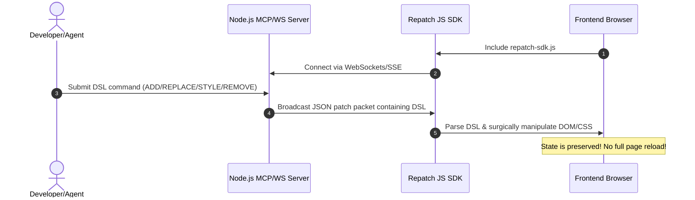

# Repatch MCP Live UI Evolution Paradigm

This example demonstrates a radical departure from traditional web development paradigms. 

Rather than regenerating entire pages, copying files, and issuing global browser page reloads (which breaks application state and is computationally slow), this architecture treats the frontend as a **continuous, live target** that is progressively mutated on-the-fly using a surgical, low-overhead Domain-Specific Language (DSL) via WebSockets/SSE.

---

## 1. Architectural Concept



Instead of deploying a whole new layout, we continuously modify the existing page by pushing fine-grained patches:
* **`ADD <selector> <html_content>`**: Appends a new child element/widget to a specific card or container.
* **`REPLACE <selector> <html_content>`**: Replaces the inner HTML of a targeted element (e.g. updating a title, swapping out control buttons).
* **`STYLE <selector> { css }`**: Scopes and injects specialized visual CSS stylesheets targeting specific sections, enabling live theme shifting.
* **`REMOVE <selector>`**: Surgically deletes deprecated elements from the layout.

This allows a development agent or LLM to build a web page incrementally—piece by piece—without losing the active state (such as text input cursor positions, active dropdowns, chart animation state, or local cache).

---

## 2. Installation & Running the Demo

To run this beautiful live evolution demo locally:

1. Navigate to the demo directory:
   ```bash
   cd examples/mcp_patch_demo
   ```
2. Install the lightweight Node.js dependencies (`express` and `ws`):
   ```bash
   npm install
   ```
3. Start the patch server:
   ```bash
   npm start
   ```
4. Open the link in your browser:
   [http://localhost:8084](http://localhost:8084)

---

## 3. Real-Time Interaction Modes

Once the page is running:
* **Virtual Console Terminal:** Watch the browser console output in real-time inside the built-in glassmorphic UI terminal. Every DSL execution is logged with specialized colored badges matching the client-side `RepatchSDK` logger output.
* **Predefined Simulation Presets:** Use the sidebar cards to simulate how an autonomous LLM agent or a remote server progressively evolves the UI (adding stats widgets, styling with neon accents, swapping menu bars, and cleaning up baseline guides).
* **Manual DSL Console:** Type custom DSL commands directly in the textarea and press "Execute DSL Command" to see your workspace mutate live!
