# System Architecture Analysis
<!-- generated in 0.00s -->

## Overview

- **Project**: /home/tom/github/semcod/nexu
- **Primary Language**: python
- **Languages**: python: 78, yaml: 9, json: 3, txt: 2, shell: 2
- **Analysis Mode**: static
- **Total Functions**: 747
- **Total Classes**: 20
- **Modules**: 101
- **Entry Points**: 206

## Architecture by Module

### examples.web_app_calculator.cinema.server
- **Functions**: 144
- **Classes**: 4
- **File**: `server.py`

### src.nexu.cinema_project_imports
- **Functions**: 80
- **File**: `cinema_project_imports.py`

### src.nexu.cinema_policy
- **Functions**: 44
- **File**: `cinema_policy.py`

### src.nexu.cinema_publish
- **Functions**: 33
- **File**: `cinema_publish.py`

### src.nexu.cinema_http_preprocess
- **Functions**: 32
- **Classes**: 1
- **File**: `cinema_http_preprocess.py`

### src.nexu.cinema_offline_options
- **Functions**: 32
- **File**: `cinema_offline_options.py`

### examples.web_app_calculator.cinema.nexu_hooks
- **Functions**: 31
- **File**: `nexu_hooks.py`

### src.nexu.cinema_projects
- **Functions**: 25
- **Classes**: 1
- **File**: `cinema_projects.py`

### src.nexu.cli
- **Functions**: 23
- **File**: `cli.py`

### sdk.js.repatch-sdk
- **Functions**: 23
- **Classes**: 1
- **File**: `repatch-sdk.js`

### src.nexu.cinema_llm
- **Functions**: 18
- **File**: `cinema_llm.py`

### src.nexu.cinema_goal_contracts
- **Functions**: 18
- **File**: `cinema_goal_contracts.py`

### examples.mcp_patch_demo.server
- **Functions**: 14
- **File**: `server.js`

### src.nexu.verify
- **Functions**: 14
- **File**: `verify.py`

### src.nexu.cinema_history
- **Functions**: 13
- **File**: `cinema_history.py`

### src.nexu.cinema_html_validate
- **Functions**: 13
- **File**: `cinema_html_validate.py`

### src.nexu.mcp_server
- **Functions**: 13
- **File**: `mcp_server.py`

### src.vico.models
- **Functions**: 10
- **Classes**: 9
- **File**: `models.py`

### src.nexu.cinema
- **Functions**: 9
- **File**: `cinema.py`

### src.nexu.cinema_server
- **Functions**: 8
- **File**: `cinema_server.py`

## Key Entry Points

Main execution flows into the system:

### examples.web_app_calculator.cinema.server._IterateHandler._build_llm_context
> Build LLM context from annotations and hints.
- **Calls**: bool, None.strip, examples.web_app_calculator.cinema.server._IterateHandler._load_policy_payload, examples.web_app_calculator.cinema.server._load_cinema_ui_profile, None.lower, list, list, examples.web_app_calculator.cinema.server._IterateHandler._merge_ui_constraints

### examples.web_app_calculator.cinema.server._IterateHandler._parse_request_data
> Parse and normalize request data.
- **Calls**: json.loads, self.data.get, int, self.data.get, None.strip, None.strip, None.strip, None.strip

### examples.web_app_pactown_ecosystem.run.main
- **Calls**: scripts.ci-cinema-smoke.print, scripts.ci-cinema-smoke.print, scripts.ci-cinema-smoke.print, scripts.ci-cinema-smoke.print, subprocess.Popen, scripts.ci-cinema-smoke.print, range, scripts.ci-cinema-smoke.print

### examples.web_app_event_monitor.run.main
- **Calls**: scripts.ci-cinema-smoke.print, scripts.ci-cinema-smoke.print, scripts.ci-cinema-smoke.print, scripts.ci-cinema-smoke.print, subprocess.Popen, scripts.ci-cinema-smoke.print, range, scripts.ci-cinema-smoke.print

### examples.web_app_calculator.cinema.server._IterateHandler._try_llm_patch_options
> Try LLM patch options for visual scopes.
- **Calls**: None.lower, None.lower, build_ui_patch_prompt, examples.web_app_calculator.cinema.server._ensure_api_key_env, time.time, examples.web_app_calculator.cinema.server._resolve_model, examples.web_app_calculator.cinema.server._llm_network_allowed, examples.web_app_calculator.cinema.server._write_llm_trace

### examples.web_app_dashboard.run.main
- **Calls**: work.exists, work.mkdir, src_dir.mkdir, shutil.copy, fixtures_dir.mkdir, shutil.copy, scripts.ci-cinema-smoke.print, src.nexu.init_project.init_project

### examples.web_app_calculator.cinema.server.CustomHTTPRequestHandler._handle_post_promote
- **Calls**: int, None.strip, self.send_response, self.send_header, self.send_header, self.end_headers, self.wfile.write, json.loads

### examples.web_app_calculator.cinema.server._IterateHandler._call_llm
> Call LLM to generate HTML.
- **Calls**: examples.web_app_calculator.cinema.server._ensure_api_key_env, time.time, examples.web_app_calculator.cinema.server._resolve_model, examples.web_app_calculator.cinema.server._llm_network_allowed, examples.web_app_calculator.cinema.server._write_llm_trace, examples.web_app_calculator.cinema.server._litellm_available, examples.web_app_calculator.cinema.server._write_llm_trace, src.nexu.cinema_llm.call_cinema_html_llm

### examples.web_app_calculator.cinema.server._IterateHandler._build_llm_prompt
> Build the LLM prompt for iteration.
- **Calls**: examples.web_app_calculator.cinema.server._effective_markpact_mode, examples.web_app_calculator.cinema.server._llm_communication_contract_block, nexu_hooks.export_markpact_readme, str, None.strip, self.ui_profile.get, active.get, active.get

### examples.web_app_calculator.cinema.server._IterateHandler._call_llm_batch_options
> Call LLM to generate batch options.
- **Calls**: self._build_batch_options_prompt, examples.web_app_calculator.cinema.server._ensure_api_key_env, time.time, examples.web_app_calculator.cinema.server._resolve_model, examples.web_app_calculator.cinema.server._llm_network_allowed, examples.web_app_calculator.cinema.server._write_llm_trace, src.nexu.cinema_llm.call_cinema_text_llm, self._parse_batch_options

### examples.web_app_calculator.cinema.server.CustomHTTPRequestHandler._handle_get_export_markpact
- **Calls**: urlparse, parse_qs, int, str, examples.web_app_calculator.cinema.server._export_markpact_markdown, payload.get, str, None.encode

### examples.web_app_calculator.cinema.server.CustomHTTPRequestHandler._handle_post_services_publish
- **Calls**: examples.web_app_calculator.cinema.server._publish_service, self.send_response, self.send_header, self.send_header, self.end_headers, self.wfile.write, json.loads, None.encode

### examples.web_app_calculator.cinema.server.CustomHTTPRequestHandler._handle_post_projects_import_zip
- **Calls**: str, self.send_response, self.send_header, self.send_header, self.end_headers, self.wfile.write, examples.web_app_calculator.cinema.server._parse_multipart_zip, isinstance

### examples.web_app_calculator.cinema.server.CustomHTTPRequestHandler._handle_post_projects_import_markpact
- **Calls**: str, self.send_response, self.send_header, self.send_header, self.end_headers, self.wfile.write, examples.web_app_calculator.cinema.server._parse_multipart_markpact, isinstance

### src.nexu.verify.verify_capsule
- **Calls**: src.nexu.capsule.load_capsule, src.nexu.paths.capsule_dir, src.nexu.verify._scan_capsule_contracts, findings.extend, src.nexu.files.collect_files, findings.extend, findings.extend, findings.extend

### examples.web_app_calculator.cinema.server.CustomHTTPRequestHandler._handle_post_propose_goal
- **Calls**: int, None.strip, self.send_response, self.send_header, self.send_header, self.end_headers, self.wfile.write, json.loads

### deploy.docker.cinema_serve.main
- **Calls**: None.resolve, int, os.environ.get, os.environ.setdefault, src.nexu.config.load_env_files, src.nexu.config.load_config, src.nexu.cinema_policy.cinema_dir_for, cinema_dir.mkdir

### examples.web_app_calculator.cinema.server.CustomHTTPRequestHandler._handle_post_history_restore
- **Calls**: None.strip, self.send_response, self.send_header, self.send_header, self.end_headers, self.wfile.write, json.loads, bool

### examples.web_app_calculator.cinema.server.CustomHTTPRequestHandler._handle_post_projects_delete
- **Calls**: unquote, self.send_response, self.send_header, self.send_header, self.end_headers, self.wfile.write, json.loads, None.strip

### examples.calculator_demo.scientific_calculator_demo.main
- **Calls**: work.exists, work.mkdir, None.mkdir, None.write_text, scripts.ci-cinema-smoke.print, src.nexu.init_project.init_project, src.vico.freeze.freeze_project, src.nexu.capsule.create_capsule

### examples.web_app_calculator.run.main
- **Calls**: work.exists, work.mkdir, src_dir.mkdir, shutil.copy, fixtures_dir.mkdir, shutil.copy, src.nexu.init_project.init_project, src.vico.freeze.freeze_project

### examples.web_app_calculator.cinema.server.CustomHTTPRequestHandler._handle_post_log
- **Calls**: json.loads, None.isoformat, data.get, data.get, LOG_CSV.exists, self.send_response, self.send_header, self.send_header

### examples.web_app_calculator.cinema.server.CustomHTTPRequestHandler.do_DELETE
- **Calls**: examples.web_app_calculator.cinema.server._path_segments, self.send_response, self.send_header, self.end_headers, len, examples.web_app_calculator.cinema.server._delete_imported_project, None.encode, self.send_response

### examples.markpact_integration.nexu_markpact_exporter.main
- **Calls**: scripts.ci-cinema-smoke.print, src_file.read_text, scripts.ci-cinema-smoke.print, scripts.ci-cinema-smoke.print, output_dir.mkdir, readme_path.write_text, scripts.ci-cinema-smoke.print, scripts.ci-cinema-smoke.print

### examples.web_app_calculator.cinema.server._IterateHandler._finalize_llm_html
> Finalize LLM-generated HTML.
- **Calls**: re.sub, re.sub, cleaned.lower, match.group, match.group, re.sub, None.strip, text.lower

### examples.web_app_calculator.cinema.server._IterateHandler._try_function_patch_options
> Try function patch options for #functions scope.
- **Calls**: None.lower, None.lower, time.time, src.nexu.cinema_dom_patch.build_function_option_patches, files.items, examples.web_app_calculator.cinema.server._write_llm_trace, None.strip, str

### examples.web_app_calculator.cinema.server.CustomHTTPRequestHandler._handle_post_manifest_apply_ledger
- **Calls**: bool, str, examples.web_app_calculator.cinema.server._nexu_hooks_apply, self.send_response, self.send_header, self.send_header, self.end_headers, self.wfile.write

### examples.web_app_calculator.cinema.server.CustomHTTPRequestHandler._handle_post_propose_llm
- **Calls**: int, str, examples.web_app_calculator.cinema.server._propose_llm_for_stage, self.send_response, self.send_header, self.send_header, self.end_headers, self.wfile.write

### examples.web_app_calculator.cinema.server.CustomHTTPRequestHandler._handle_post_services_start
- **Calls**: None.strip, self.send_response, self.send_header, self.send_header, self.end_headers, self.wfile.write, json.loads, examples.web_app_calculator.cinema.server._start_service

### examples.web_app_calculator.cinema.server.CustomHTTPRequestHandler._handle_post_services_stop
- **Calls**: None.strip, self.send_response, self.send_header, self.send_header, self.end_headers, self.wfile.write, json.loads, examples.web_app_calculator.cinema.server._stop_service

## Process Flows

Key execution flows identified:

### Flow 1: _build_llm_context
```
_build_llm_context [examples.web_app_calculator.cinema.server._IterateHandler]
  └─> _load_policy_payload
  └─ →> _load_cinema_ui_profile
      └─ →> load_cinema_ui_profile
```

### Flow 2: _parse_request_data
```
_parse_request_data [examples.web_app_calculator.cinema.server._IterateHandler]
```

### Flow 3: main
```
main [examples.web_app_pactown_ecosystem.run]
  └─ →> print
  └─ →> print
```

### Flow 4: _try_llm_patch_options
```
_try_llm_patch_options [examples.web_app_calculator.cinema.server._IterateHandler]
  └─ →> _ensure_api_key_env
      └─> _load_all_env
          └─> _load_env_file
```

### Flow 5: _handle_post_promote
```
_handle_post_promote [examples.web_app_calculator.cinema.server.CustomHTTPRequestHandler]
```

### Flow 6: _call_llm
```
_call_llm [examples.web_app_calculator.cinema.server._IterateHandler]
  └─ →> _ensure_api_key_env
      └─> _load_all_env
          └─> _load_env_file
  └─ →> _resolve_model
      └─> _load_all_env
          └─> _load_env_file
```

### Flow 7: _build_llm_prompt
```
_build_llm_prompt [examples.web_app_calculator.cinema.server._IterateHandler]
  └─ →> _effective_markpact_mode
      └─ →> effective_markpact_mode
  └─ →> _llm_communication_contract_block
      └─ →> build_llm_contract_block
          └─> build_llm_communication_contract_lines
```

### Flow 8: _call_llm_batch_options
```
_call_llm_batch_options [examples.web_app_calculator.cinema.server._IterateHandler]
  └─ →> _ensure_api_key_env
      └─> _load_all_env
          └─> _load_env_file
  └─ →> _resolve_model
      └─> _load_all_env
          └─> _load_env_file
```

### Flow 9: _handle_get_export_markpact
```
_handle_get_export_markpact [examples.web_app_calculator.cinema.server.CustomHTTPRequestHandler]
  └─ →> _export_markpact_markdown
```

### Flow 10: _handle_post_services_publish
```
_handle_post_services_publish [examples.web_app_calculator.cinema.server.CustomHTTPRequestHandler]
  └─ →> _publish_service
```

## Key Classes

### examples.web_app_calculator.cinema.server.CustomHTTPRequestHandler
- **Methods**: 36
- **Key Methods**: examples.web_app_calculator.cinema.server.CustomHTTPRequestHandler.__init__, examples.web_app_calculator.cinema.server.CustomHTTPRequestHandler._handle_get_root_redirect, examples.web_app_calculator.cinema.server.CustomHTTPRequestHandler._handle_get_policy, examples.web_app_calculator.cinema.server.CustomHTTPRequestHandler._handle_get_projects_catalog, examples.web_app_calculator.cinema.server.CustomHTTPRequestHandler._handle_get_projects_active, examples.web_app_calculator.cinema.server.CustomHTTPRequestHandler._handle_get_services_catalog, examples.web_app_calculator.cinema.server.CustomHTTPRequestHandler._handle_get_health, examples.web_app_calculator.cinema.server.CustomHTTPRequestHandler._handle_get_llm_status, examples.web_app_calculator.cinema.server.CustomHTTPRequestHandler._handle_get_llm_traces, examples.web_app_calculator.cinema.server.CustomHTTPRequestHandler._handle_get_imported_project_route
- **Inherits**: http.server.SimpleHTTPRequestHandler

### examples.web_app_calculator.cinema.server._IterateHandler
> Helper class to handle the /iterate endpoint logic, reducing cyclomatic complexity.
- **Methods**: 31
- **Key Methods**: examples.web_app_calculator.cinema.server._IterateHandler.__init__, examples.web_app_calculator.cinema.server._IterateHandler.handle, examples.web_app_calculator.cinema.server._IterateHandler._parse_request_data, examples.web_app_calculator.cinema.server._IterateHandler._restore_http_import_stages_if_needed, examples.web_app_calculator.cinema.server._IterateHandler._read_current_stage_html, examples.web_app_calculator.cinema.server._IterateHandler._build_llm_context, examples.web_app_calculator.cinema.server._IterateHandler._determine_iteration_mode, examples.web_app_calculator.cinema.server._IterateHandler._execute_iteration, examples.web_app_calculator.cinema.server._IterateHandler._execute_options_mode, examples.web_app_calculator.cinema.server._IterateHandler._execute_options_llm

### sdk.js.repatch-sdk.RepatchSDK
- **Methods**: 23
- **Key Methods**: sdk.js.repatch-sdk.RepatchSDK.connect, sdk.js.repatch-sdk.RepatchSDK._connectWS, sdk.js.repatch-sdk.RepatchSDK.payload, sdk.js.repatch-sdk.RepatchSDK.setTimeout, sdk.js.repatch-sdk.RepatchSDK._connectSSE, sdk.js.repatch-sdk.RepatchSDK.payload, sdk.js.repatch-sdk.RepatchSDK.onPatch, sdk.js.repatch-sdk.RepatchSDK.apply, sdk.js.repatch-sdk.RepatchSDK.dslClean, sdk.js.repatch-sdk.RepatchSDK.addMatch

### src.nexu.cinema_http_preprocess._OutlineParser
- **Methods**: 5
- **Key Methods**: src.nexu.cinema_http_preprocess._OutlineParser.__init__, src.nexu.cinema_http_preprocess._OutlineParser._keep_attr, src.nexu.cinema_http_preprocess._OutlineParser.handle_starttag, src.nexu.cinema_http_preprocess._OutlineParser.handle_endtag, src.nexu.cinema_http_preprocess._OutlineParser.handle_data
- **Inherits**: HTMLParser

### src.vico.models.FrozenSnapshot
- **Methods**: 2
- **Key Methods**: src.vico.models.FrozenSnapshot.to_dict, src.vico.models.FrozenSnapshot.from_dict

### src.vico.models.Capsule
- **Methods**: 2
- **Key Methods**: src.vico.models.Capsule.to_dict, src.vico.models.Capsule.from_dict

### src.nexu.cinema_projects.ExampleProject
- **Methods**: 1
- **Key Methods**: src.nexu.cinema_projects.ExampleProject.to_public_dict

### src.vico.models.VerificationReport
- **Methods**: 1
- **Key Methods**: src.vico.models.VerificationReport.to_dict

### src.vico.models.CapsuleDiff
- **Methods**: 1
- **Key Methods**: src.vico.models.CapsuleDiff.to_dict

### src.vico.models.PromptExport
- **Methods**: 1
- **Key Methods**: src.vico.models.PromptExport.to_dict

### examples.web_app_calculator.cinema.server.ThreadingHTTPServer
- **Methods**: 0
- **Inherits**: socketserver.ThreadingMixIn, socketserver.TCPServer

### src.nexu.config.LLMConfig
- **Methods**: 0

### src.nexu.config.ReviewConfig
- **Methods**: 0

### src.nexu.config.CinemaConfig
> Cinema live iteration tuning (also overridable via CINEMA_* env vars).
- **Methods**: 0

### src.nexu.config.nexuConfig
- **Methods**: 0

### src.vico.models.FrozenFile
- **Methods**: 0

### src.vico.models.CapsuleSelection
- **Methods**: 0

### src.vico.models.CapsuleRuntime
- **Methods**: 0

### src.vico.models.VerificationFinding
- **Methods**: 0

### src.nexu.fast_delivery.router.DeliveryRoute
> Selected route for one improvement-loop step.
- **Methods**: 0

## Data Transformation Functions

Key functions that process and transform data:

### examples.mcp_patch_demo.server.serialized
- **Output to**: examples.mcp_patch_demo.server.forEach, examples.mcp_patch_demo.server.send

### examples.web_app_calculator.cinema.nexu_hooks.validate_artifact
- **Output to**: src.nexu.cinema_policy.validate_intract_artifact

### examples.web_app_calculator.cinema.server._parse_imported_project_route
- **Output to**: examples.web_app_calculator.cinema.server._path_segments, len

### examples.web_app_calculator.cinema.server._validate_intract_artifact
- **Output to**: nexu_hooks.validate_artifact

### examples.web_app_calculator.cinema.server._parse_multipart_upload
- **Output to**: bytes, None.parsebytes, msg.walk, None.lower, part.get

### examples.web_app_calculator.cinema.server._parse_multipart_zip
- **Output to**: examples.web_app_calculator.cinema.server._parse_multipart_upload

### examples.web_app_calculator.cinema.server._parse_multipart_markpact
- **Output to**: examples.web_app_calculator.cinema.server._parse_multipart_upload

### examples.web_app_calculator.cinema.server._IterateHandler._parse_request_data
> Parse and normalize request data.
- **Output to**: json.loads, self.data.get, int, self.data.get, None.strip

### examples.web_app_calculator.cinema.server._IterateHandler._validate_intract_artifact
> Validate Intract artifact if evolved HTML exists.
- **Output to**: examples.web_app_calculator.cinema.server._IterateHandler._validate_intract_artifact, self.policy_entry.get

### examples.web_app_calculator.cinema.server._IterateHandler._parse_batch_options
> Parse batch options from LLM response.
- **Output to**: src.nexu.cinema_llm.parse_batch_alt_options, str, self.ui_profile.get

### src.nexu.cinema_http_preprocess._write_preprocess_artifacts
- **Output to**: list, src.nexu.cinema_http_preprocess.extract_visual_css, src.nexu.cinema_http_preprocess.build_html_outline, css_path.write_text, outline_path.write_text

### src.nexu.cinema_http_preprocess.preprocess_cinema_seed
> Write nexu-visual.css and nexu-outline.html beside stage0.html; return active_project fields.
- **Output to**: src.nexu.cinema_http_preprocess._write_preprocess_artifacts, stage0.is_file, stage0.read_text

### src.nexu.cinema_http_preprocess.http_preprocess_artifacts_present
> True when compact LLM patch artifacts exist under source_dir.
- **Output to**: str, str, None.is_file, None.is_file, isinstance

### src.nexu.cinema_http_preprocess.ensure_http_preprocess_artifacts
> Regenerate nexu-visual.css + nexu-outline.html when missing (HTTP re-activate migration).
- **Output to**: src.nexu.cinema_http_preprocess.http_preprocess_artifacts_present, src.nexu.cinema_http_preprocess.preprocess_http_import, source_dir.is_dir

### src.nexu.cinema_http_preprocess.preprocess_http_import
> Write nexu-visual.css and nexu-outline.html under source_dir; return project.json fields.
- **Output to**: meta.get, isinstance, index_path.is_file, index_path.is_file, index_path.read_text

### src.nexu.cinema_http_preprocess.load_cinema_seed_preprocess_artifacts
> Load compact seed preprocess artifacts from cinema dir when active_project uses patch mode.
- **Output to**: Path, str, str, isinstance, str

### src.nexu.cinema_http_preprocess.load_http_preprocess_artifacts
> Load compact HTTP import artifacts for LLM prompts when the active project is http-*.
- **Output to**: str, src.nexu.cinema_http_preprocess._project_meta_path, src.nexu.cinema_http_preprocess._load_project_meta, src.nexu.cinema_http_preprocess._read_http_source_artifacts, src.nexu.cinema_http_preprocess._load_organize_patch_context

### src.nexu.cinema_llm.parse_batch_alt_options
> Parse NEXU_ALT_A/B/C marked batch LLM output into option filenames.
- **Output to**: src.nexu.cinema_llm._strip_rich_console_artifacts, _BATCH_ALT_FILES.items, re.search, src.nexu.cinema_html_validate.prepare_cinema_html_document, set

### src.nexu.cinema_project_imports._validate_http_url
- **Output to**: urlparse, url.strip

### src.nexu.cinema_project_imports._validate_git_url
- **Output to**: url.strip, source.lower, lowered.startswith, lowered.startswith, re.match

### src.nexu.cinema_project_imports._decode_http_bytes
- **Output to**: src.nexu.cinema_project_imports._charset_from_content_type, body.decode, body.decode

### src.nexu.cinema_project_imports._parse_srcset
- **Output to**: None.split, item.strip, piece.split, None.join, out.append

### src.nexu.cinema_project_imports._format_srcset
- **Output to**: None.join, chunks.append, None.strip

### src.nexu.cinema_project_imports._apply_http_preprocess_fields
- **Output to**: list, None.strip, updated.get, any, artifacts.append

### src.nexu.cinema_project_imports._refresh_http_preprocess_if_needed
- **Output to**: str, Path, src.nexu.cinema_project_imports._load_http_fetch_meta, src.nexu.cinema_http_preprocess.ensure_http_preprocess_artifacts, src.nexu.cinema_project_imports._apply_http_preprocess_fields

## Behavioral Patterns

### recursion__append_policy_entry
- **Type**: recursion
- **Confidence**: 0.90
- **Functions**: examples.web_app_calculator.cinema.server._IterateHandler._append_policy_entry

### recursion__validate_intract_artifact
- **Type**: recursion
- **Confidence**: 0.90
- **Functions**: examples.web_app_calculator.cinema.server._IterateHandler._validate_intract_artifact

### recursion__save_history_checkpoint
- **Type**: recursion
- **Confidence**: 0.90
- **Functions**: examples.web_app_calculator.cinema.server._IterateHandler._save_history_checkpoint

### state_machine_RepatchSDK
- **Type**: state_machine
- **Confidence**: 0.70
- **Functions**: sdk.js.repatch-sdk.RepatchSDK.connect, sdk.js.repatch-sdk.RepatchSDK._connectWS, sdk.js.repatch-sdk.RepatchSDK.payload, sdk.js.repatch-sdk.RepatchSDK.setTimeout, sdk.js.repatch-sdk.RepatchSDK._connectSSE

## Public API Surface

Functions exposed as public API (no underscore prefix):

- `src.nexu.config.load_config` - 76 calls
- `examples.web_app_pactown_ecosystem.run.main` - 39 calls
- `examples.web_app_event_monitor.run.main` - 37 calls
- `examples.web_app_dashboard.run.main` - 35 calls
- `src.nexu.cinema.build_intract_policy_snapshot` - 32 calls
- `src.nexu.report.build_capsule_report` - 32 calls
- `src.nexu.orchestrate.build_capsule_orchestration` - 28 calls
- `examples.runner.run_examples.run_example` - 26 calls
- `src.nexu.verify.verify_capsule` - 26 calls
- `src.nexu.cinema_baseline_contracts.ensure_capsule_intract_yaml` - 25 calls
- `deploy.docker.cinema_serve.main` - 25 calls
- `src.nexu.review.build_review_packet` - 24 calls
- `src.nexu.cinema_offline_options.build_chemical_option_html` - 24 calls
- `src.nexu.capsule.create_capsule` - 24 calls
- `examples.calculator_demo.scientific_calculator_demo.main` - 23 calls
- `examples.web_app_calculator.run.main` - 23 calls
- `examples.web_app_calculator.cinema.server.CustomHTTPRequestHandler.do_DELETE` - 23 calls
- `examples.markpact_integration.nexu_markpact_exporter.main` - 22 calls
- `src.nexu.orchestrate.offline_orchestration_from_context` - 22 calls
- `src.nexu.cinema_project_imports.import_http_project` - 21 calls
- `src.nexu.cinema_markpact.build_markpact_readme` - 21 calls
- `scripts.check-doc-links.check_links` - 21 calls
- `src.nexu.cinema_html_validate.relocate_style_tags_to_head` - 20 calls
- `src.nexu.cinema_html_validate.repair_html_structure` - 20 calls
- `examples.web_app_calculator.cinema.nexu_hooks.append_goal_policy_entry` - 19 calls
- `examples.web_app_calculator.cinema.server._IterateHandler.handle` - 19 calls
- `src.nexu.cli.capsule_diff` - 19 calls
- `src.nexu.cinema_http_preprocess.extract_visual_css` - 19 calls
- `src.nexu.cinema_history.save_history_checkpoint` - 19 calls
- `src.nexu.cinema.generate_cinema_player` - 18 calls
- `src.nexu.cinema_http_preprocess.load_cinema_seed_preprocess_artifacts` - 18 calls
- `src.nexu.cinema_traces.write_llm_trace` - 18 calls
- `src.nexu.cinema_project_imports.import_markpact_project` - 18 calls
- `src.nexu.cinema_history.restore_history_checkpoint` - 18 calls
- `src.nexu.export_prompt.export_iteration_prompt` - 18 calls
- `examples.calculator_demo.scientific_calculator_demo2.main` - 17 calls
- `src.nexu.cli.capsule_status_command` - 17 calls
- `src.nexu.cli.capsule_journal` - 17 calls
- `src.nexu.cinema_project_imports.read_imported_markpact` - 17 calls
- `src.nexu.cinema_projects.delete_example_project` - 17 calls

## System Interactions

How components interact:

```mermaid
graph TD
    _build_llm_context --> bool
    _build_llm_context --> strip
    _build_llm_context --> _load_policy_payload
    _build_llm_context --> _load_cinema_ui_prof
    _build_llm_context --> lower
    _parse_request_data --> loads
    _parse_request_data --> get
    _parse_request_data --> int
    _parse_request_data --> strip
    main --> print
    main --> Popen
    _try_llm_patch_optio --> lower
    _try_llm_patch_optio --> build_ui_patch_promp
    _try_llm_patch_optio --> _ensure_api_key_env
    _try_llm_patch_optio --> time
    main --> exists
    main --> mkdir
    main --> copy
    _handle_post_promote --> int
    _handle_post_promote --> strip
    _handle_post_promote --> send_response
    _handle_post_promote --> send_header
    _call_llm --> _ensure_api_key_env
    _call_llm --> time
    _call_llm --> _resolve_model
    _call_llm --> _llm_network_allowed
    _call_llm --> _write_llm_trace
    _build_llm_prompt --> _effective_markpact_
    _build_llm_prompt --> _llm_communication_c
    _build_llm_prompt --> export_markpact_read
```



## Reverse Engineering Guidelines

1. **Entry Points**: Start analysis from the entry points listed above
2. **Core Logic**: Focus on classes with many methods
3. **Data Flow**: Follow data transformation functions
4. **Process Flows**: Use the flow diagrams for execution paths
5. **API Surface**: Public API functions reveal the interface

## Context for LLM

Maintain the identified architectural patterns and public API surface when suggesting changes.