# System Architecture Analysis
<!-- generated in 0.00s -->

## Overview

- **Project**: /home/tom/github/semcod/nexu
- **Primary Language**: python
- **Languages**: python: 80, yaml: 9, txt: 2, shell: 2, json: 2
- **Analysis Mode**: static
- **Total Functions**: 668
- **Total Classes**: 20
- **Modules**: 99
- **Entry Points**: 113

## Architecture by Module

### examples.web_app_calculator.cinema.server
- **Functions**: 68
- **Classes**: 2
- **File**: `server.py`

### src.nexu.cinema_project_imports
- **Functions**: 52
- **File**: `cinema_project_imports.py`

### src.nexu.cinema_policy
- **Functions**: 40
- **File**: `cinema_policy.py`

### src.nexu.cinema_offline_options
- **Functions**: 32
- **File**: `cinema_offline_options.py`

### src.nexu.cinema_http_preprocess
- **Functions**: 30
- **Classes**: 1
- **File**: `cinema_http_preprocess.py`

### examples.web_app_calculator.cinema.nexu_hooks
- **Functions**: 28
- **File**: `nexu_hooks.py`

### src.nexu.cinema_projects
- **Functions**: 25
- **Classes**: 1
- **File**: `cinema_projects.py`

### src.nexu.cinema_marked_context
- **Functions**: 25
- **File**: `cinema_marked_context.py`

### src.nexu.cli
- **Functions**: 23
- **File**: `cli.py`

### src.nexu.cinema_publish
- **Functions**: 23
- **File**: `cinema_publish.py`

### src.nexu.cinema_scope
- **Functions**: 22
- **File**: `cinema_scope.py`

### src.nexu.cinema_llm
- **Functions**: 18
- **File**: `cinema_llm.py`

### src.nexu.cinema_goal_contracts
- **Functions**: 15
- **File**: `cinema_goal_contracts.py`

### src.nexu.verify
- **Functions**: 14
- **File**: `verify.py`

### src.nexu.cinema_history
- **Functions**: 13
- **File**: `cinema_history.py`

### src.nexu.cinema_html_validate
- **Functions**: 13
- **File**: `cinema_html_validate.py`

### src.nexu.mcp_server
- **Functions**: 13
- **File**: `mcp_server.py`

### src.nexu.cinema_ui_patch
- **Functions**: 10
- **File**: `cinema_ui_patch.py`

### src.vico.models
- **Functions**: 10
- **Classes**: 9
- **File**: `models.py`

### src.nexu.cinema
- **Functions**: 9
- **File**: `cinema.py`

## Key Entry Points

Main execution flows into the system:

### examples.web_app_calculator.cinema.server.CustomHTTPRequestHandler.do_POST
- **Calls**: None.do_POST, int, self.rfile.read, json.loads, None.isoformat, data.get, data.get, LOG_CSV.exists

### examples.web_app_calculator.cinema.server.CustomHTTPRequestHandler.do_GET
- **Calls**: examples.web_app_calculator.cinema.server._parse_imported_project_route, self.path.startswith, self.path.startswith, None.do_GET, player_path.is_file, None.encode, self.send_response, self.send_header

### examples.web_app_pactown_ecosystem.run.main
- **Calls**: scripts.ci-cinema-smoke.print, scripts.ci-cinema-smoke.print, scripts.ci-cinema-smoke.print, scripts.ci-cinema-smoke.print, subprocess.Popen, scripts.ci-cinema-smoke.print, range, scripts.ci-cinema-smoke.print

### examples.web_app_event_monitor.run.main
- **Calls**: scripts.ci-cinema-smoke.print, scripts.ci-cinema-smoke.print, scripts.ci-cinema-smoke.print, scripts.ci-cinema-smoke.print, subprocess.Popen, scripts.ci-cinema-smoke.print, range, scripts.ci-cinema-smoke.print

### examples.web_app_dashboard.run.main
- **Calls**: work.exists, work.mkdir, src_dir.mkdir, shutil.copy, fixtures_dir.mkdir, shutil.copy, scripts.ci-cinema-smoke.print, src.nexu.init_project.init_project

### src.nexu.verify.verify_capsule
- **Calls**: src.nexu.capsule.load_capsule, src.nexu.paths.capsule_dir, src.nexu.verify._scan_capsule_contracts, findings.extend, src.nexu.files.collect_files, findings.extend, findings.extend, findings.extend

### examples.scientific_calculator_demo.main
- **Calls**: work.exists, work.mkdir, None.mkdir, None.write_text, scripts.ci-cinema-smoke.print, src.nexu.init_project.init_project, src.vico.freeze.freeze_project, src.nexu.capsule.create_capsule

### examples.web_app_calculator.run.main
- **Calls**: work.exists, work.mkdir, src_dir.mkdir, shutil.copy, fixtures_dir.mkdir, shutil.copy, src.nexu.init_project.init_project, src.vico.freeze.freeze_project

### examples.web_app_calculator.cinema.server.CustomHTTPRequestHandler.do_DELETE
- **Calls**: examples.web_app_calculator.cinema.server._path_segments, self.send_response, self.send_header, self.end_headers, len, examples.web_app_calculator.cinema.server._delete_imported_project, None.encode, self.send_response

### examples.nexu_markpact_exporter.main
- **Calls**: scripts.ci-cinema-smoke.print, src_file.read_text, scripts.ci-cinema-smoke.print, scripts.ci-cinema-smoke.print, output_dir.mkdir, readme_path.write_text, scripts.ci-cinema-smoke.print, scripts.ci-cinema-smoke.print

### examples.web_app_calculator.cinema.nexu_hooks.append_goal_policy_entry
- **Calls**: None.strip, None.strip, src.nexu.cinema_policy.append_goal_ledger_entry, None.resolve, src.nexu.cinema_projects.load_active_project, None.strip, None.strip, str

### src.nexu.cli.capsule_diff
> Compare capsule src files against the frozen baseline lock.
- **Calls**: capsule_app.command, src.nexu.paths.project_root, src.vico.diff.diff_capsule, Table, table.add_row, table.add_row, table.add_row, table.add_row

### examples.scientific_calculator_demo2.main
- **Calls**: work.exists, work.mkdir, None.mkdir, original_file.write_text, examples.scientific_calculator_demo2.print_code, src.nexu.init_project.init_project, src.vico.freeze.freeze_project, src.nexu.capsule.create_capsule

### src.nexu.cli.capsule_status_command
> Show capsule status, latest iteration, diff counters and verification summary.
- **Calls**: capsule_app.command, src.nexu.paths.project_root, src.vico.status.capsule_status, console.print, console.print, console.print, Table, files.items

### src.nexu.cli.capsule_journal
> Show capsule event journal.
- **Calls**: capsule_app.command, src.nexu.paths.project_root, Table, console.print, src.nexu.journal.read_journal, table.add_row, str, str

### src.vico.models.Capsule.from_dict
- **Calls**: CapsuleSelection, CapsuleRuntime, cls, data.get, data.get, data.get, data.get, data.get

### examples.web_app_calculator.cinema.nexu_hooks.patch_option_previews
> Apply DELETE policy to alt_a/b/c without copying workspace.
- **Calls**: src.nexu.cinema_policy.load_effective_ui_constraints, src.nexu.cinema_policy.enforce_deletes_on_option_previews, None.resolve, src.nexu.cinema_policy.merge_ui_constraint_lists, list, list, list, list

### src.nexu.cli.capsule_create
> Create an isolated capsule from selected project files.
- **Calls**: capsule_app.command, src.nexu.paths.project_root, src.nexu.capsule.create_capsule, src.nexu.blueprint.build_blueprint, console.print, console.print, console.print, typer.Argument

### src.nexu.cli.capsule_iterate
> Create planned S1..Sn iteration folders and prompts.
- **Calls**: capsule_app.command, src.nexu.paths.project_root, src.nexu.iterate.iterate_capsule, src.nexu.journal.append_journal, console.print, src.nexu.cinema.generate_cinema_player, console.print, typer.Argument

### src.nexu.cli.capsule_orchestrate
> Build an offline or LLM-assisted orchestration plan for capsule evolution.
- **Calls**: capsule_app.command, src.nexu.paths.project_root, src.nexu.orchestrate.build_capsule_orchestration, console.print, console.print, console.print, typer.Argument, typer.Option

### src.nexu.cli.capsule_promote
> Build a promotion plan for copying capsule changes back to the source project.
- **Calls**: capsule_app.command, src.nexu.paths.project_root, src.nexu.promote.build_promotion_plan, console.print, console.print, src.nexu.promote.apply_promotion_plan, console.print, typer.Argument

### src.nexu.cinema_dom_patch.build_function_option_patches
> Create A-C function variants by patching the current HTML locally.
- **Calls**: src.nexu.cinema_dom_patch._strip_existing_patch, src.nexu.cinema_project_ir.build_project_ir, src.nexu.cinema_offline_options._delete_without_keeps, src.nexu.cinema_dom_patch.supports_function_patch, list, list, src.nexu.cinema_dom_patch._inject_into_head, src.nexu.cinema_dom_patch._inject_into_body

### src.nexu.cli.capsule_review
> Build an evidence-based review packet for human or optional LLM review.
- **Calls**: capsule_app.command, src.nexu.paths.project_root, src.nexu.review.build_review_packet, console.print, console.print, console.print, typer.Argument, typer.Option

### examples.web_app_calculator.cinema.server._extract_llm_content
- **Calls**: getattr, getattr, getattr, isinstance, str, None.join, isinstance, item.get

### src.nexu.cli.capsule_plan
> Create a deterministic S1..Sn capsule iteration plan.
- **Calls**: capsule_app.command, src.nexu.paths.project_root, src.nexu.plan.build_iteration_plan, console.print, console.print, src.nexu.cli._print_yaml, typer.Argument, typer.Option

### src.nexu.cinema_project_ir._ProjectIRParser.handle_endtag
- **Calls**: tag.lower, self._stack.pop, src.nexu.cinema_project_ir._clean_text, self._classify_node, max, None.extend, None.join, attrs.get

### src.nexu.cinema_options_cache.apply_options_cache
- **Calls**: list, enumerate, cached.get, files.get, None.write_text, written.append, cached.get, len

### examples.realtime_lane_nexu_sync.simulate_realtime_sync
- **Calls**: scripts.ci-cinema-smoke.print, scripts.ci-cinema-smoke.print, scripts.ci-cinema-smoke.print, scripts.ci-cinema-smoke.print, scripts.ci-cinema-smoke.print, scripts.ci-cinema-smoke.print, analyze_project, scripts.ci-cinema-smoke.print

### src.nexu.cinema_project_ir._ProjectIRParser._classify_node
- **Calls**: self.cards.append, self.headings.append, None.lower, self.actions.append, attrs.get, attrs.get, attrs.get, src.nexu.cinema_project_ir._clean_text

### src.nexu.cli.freeze
> Freeze a lightweight hash snapshot of the current project.
- **Calls**: app.command, src.nexu.paths.project_root, src.vico.freeze.freeze_project, console.print, console.print, console.print, typer.Argument, typer.Option

## Process Flows

Key execution flows identified:

### Flow 1: do_POST
```
do_POST [examples.web_app_calculator.cinema.server.CustomHTTPRequestHandler]
```

### Flow 2: do_GET
```
do_GET [examples.web_app_calculator.cinema.server.CustomHTTPRequestHandler]
  └─ →> _parse_imported_project_route
      └─> _path_segments
```

### Flow 3: main
```
main [examples.web_app_pactown_ecosystem.run]
  └─ →> print
  └─ →> print
```

### Flow 4: verify_capsule
```
verify_capsule [src.nexu.verify]
  └─> _scan_capsule_contracts
      └─ →> read_manifest_contracts
      └─ →> scan_contracts_in_file
          └─> scan_contracts_in_text
  └─ →> load_capsule
      └─ →> read_yaml
      └─ →> capsule_dir
          └─> capsules_dir
  └─ →> capsule_dir
      └─> capsules_dir
          └─> nexu_dir
```

### Flow 5: do_DELETE
```
do_DELETE [examples.web_app_calculator.cinema.server.CustomHTTPRequestHandler]
  └─ →> _path_segments
```

### Flow 6: append_goal_policy_entry
```
append_goal_policy_entry [examples.web_app_calculator.cinema.nexu_hooks]
  └─ →> append_goal_ledger_entry
      └─> normalize_proposals_for_ledger
          └─> _proposal_kind_and_element
      └─> append_policy_ledger_entry
  └─ →> load_active_project
```

### Flow 7: capsule_diff
```
capsule_diff [src.nexu.cli]
  └─ →> project_root
  └─ →> diff_capsule
      └─ →> load_capsule
          └─ →> read_yaml
          └─ →> capsule_dir
```

### Flow 8: capsule_status_command
```
capsule_status_command [src.nexu.cli]
  └─ →> project_root
  └─ →> capsule_status
      └─ →> load_capsule
          └─ →> read_yaml
          └─ →> capsule_dir
```

### Flow 9: capsule_journal
```
capsule_journal [src.nexu.cli]
  └─ →> project_root
  └─ →> read_journal
      └─> journal_path
          └─ →> capsule_dir
      └─ →> read_yaml
```

### Flow 10: from_dict
```
from_dict [src.vico.models.Capsule]
```

## Key Classes

### examples.web_app_calculator.cinema.server.CustomHTTPRequestHandler
- **Methods**: 5
- **Key Methods**: examples.web_app_calculator.cinema.server.CustomHTTPRequestHandler.__init__, examples.web_app_calculator.cinema.server.CustomHTTPRequestHandler.do_GET, examples.web_app_calculator.cinema.server.CustomHTTPRequestHandler.do_POST, examples.web_app_calculator.cinema.server.CustomHTTPRequestHandler.do_DELETE, examples.web_app_calculator.cinema.server.CustomHTTPRequestHandler.do_OPTIONS
- **Inherits**: http.server.SimpleHTTPRequestHandler

### src.nexu.cinema_project_ir._ProjectIRParser
- **Methods**: 5
- **Key Methods**: src.nexu.cinema_project_ir._ProjectIRParser.__init__, src.nexu.cinema_project_ir._ProjectIRParser.handle_starttag, src.nexu.cinema_project_ir._ProjectIRParser._classify_node, src.nexu.cinema_project_ir._ProjectIRParser.handle_endtag, src.nexu.cinema_project_ir._ProjectIRParser.handle_data
- **Inherits**: HTMLParser

### src.nexu.cinema_http_preprocess._OutlineParser
- **Methods**: 5
- **Key Methods**: src.nexu.cinema_http_preprocess._OutlineParser.__init__, src.nexu.cinema_http_preprocess._OutlineParser._keep_attr, src.nexu.cinema_http_preprocess._OutlineParser.handle_starttag, src.nexu.cinema_http_preprocess._OutlineParser.handle_endtag, src.nexu.cinema_http_preprocess._OutlineParser.handle_data
- **Inherits**: HTMLParser

### src.vico.models.FrozenSnapshot
- **Methods**: 2
- **Key Methods**: src.vico.models.FrozenSnapshot.to_dict, src.vico.models.FrozenSnapshot.from_dict

### src.vico.models.Capsule
- **Methods**: 2
- **Key Methods**: src.vico.models.Capsule.to_dict, src.vico.models.Capsule.from_dict

### src.nexu.intract.IntentContract
- **Methods**: 1
- **Key Methods**: src.nexu.intract.IntentContract.key

### src.nexu.cinema_projects.ExampleProject
- **Methods**: 1
- **Key Methods**: src.nexu.cinema_projects.ExampleProject.to_public_dict

### src.vico.models.VerificationReport
- **Methods**: 1
- **Key Methods**: src.vico.models.VerificationReport.to_dict

### src.vico.models.CapsuleDiff
- **Methods**: 1
- **Key Methods**: src.vico.models.CapsuleDiff.to_dict

### src.vico.models.PromptExport
- **Methods**: 1
- **Key Methods**: src.vico.models.PromptExport.to_dict

### examples.web_app_calculator.cinema.server.ThreadingHTTPServer
- **Methods**: 0
- **Inherits**: socketserver.ThreadingMixIn, socketserver.TCPServer

### src.nexu.config.LLMConfig
- **Methods**: 0

### src.nexu.config.ReviewConfig
- **Methods**: 0

### src.nexu.config.CinemaConfig
> Cinema live iteration tuning (also overridable via CINEMA_* env vars).
- **Methods**: 0

### src.nexu.config.nexuConfig
- **Methods**: 0

### src.vico.models.FrozenFile
- **Methods**: 0

### src.vico.models.CapsuleSelection
- **Methods**: 0

### src.vico.models.CapsuleRuntime
- **Methods**: 0

### src.vico.models.VerificationFinding
- **Methods**: 0

### src.nexu.fast_delivery.router.DeliveryRoute
> Selected route for one improvement-loop step.
- **Methods**: 0

## Data Transformation Functions

Key functions that process and transform data:

### examples.web_app_calculator.cinema.nexu_hooks.validate_artifact
- **Output to**: src.nexu.cinema_policy.validate_intract_artifact

### examples.web_app_calculator.cinema.server._parse_imported_project_route
- **Output to**: examples.web_app_calculator.cinema.server._path_segments, len

### examples.web_app_calculator.cinema.server._validate_intract_artifact
- **Output to**: nexu_hooks.validate_artifact

### examples.web_app_calculator.cinema.server._parse_multipart_zip
- **Output to**: cgi.FieldStorage, str, upload.file.read, str, len

### src.nexu.intract.format_intract_v1_line
- **Output to**: contract.meaning.replace

### src.nexu.intract.parse_intract_line
- **Output to**: src.nexu.intract._tokenize_contract, line.strip, IntentContract, fields.get, fields.get

### src.nexu.cinema_http_preprocess._write_preprocess_artifacts
- **Output to**: list, src.nexu.cinema_http_preprocess.extract_visual_css, src.nexu.cinema_http_preprocess.build_html_outline, css_path.write_text, outline_path.write_text

### src.nexu.cinema_http_preprocess.preprocess_cinema_seed
> Write nexu-visual.css and nexu-outline.html beside stage0.html; return active_project fields.
- **Output to**: src.nexu.cinema_http_preprocess._write_preprocess_artifacts, stage0.is_file, stage0.read_text

### src.nexu.cinema_http_preprocess.http_preprocess_artifacts_present
> True when compact LLM patch artifacts exist under source_dir.
- **Output to**: str, str, None.is_file, None.is_file, isinstance

### src.nexu.cinema_http_preprocess.ensure_http_preprocess_artifacts
> Regenerate nexu-visual.css + nexu-outline.html when missing (HTTP re-activate migration).
- **Output to**: src.nexu.cinema_http_preprocess.http_preprocess_artifacts_present, src.nexu.cinema_http_preprocess.preprocess_http_import, source_dir.is_dir

### src.nexu.cinema_http_preprocess.preprocess_http_import
> Write nexu-visual.css and nexu-outline.html under source_dir; return project.json fields.
- **Output to**: meta.get, isinstance, index_path.is_file, index_path.is_file, index_path.read_text

### src.nexu.cinema_http_preprocess.load_cinema_seed_preprocess_artifacts
> Load compact seed preprocess artifacts from cinema dir when active_project uses patch mode.
- **Output to**: Path, str, str, isinstance, str

### src.nexu.cinema_http_preprocess.load_http_preprocess_artifacts
> Load compact HTTP import artifacts for LLM prompts when the active project is http-*.
- **Output to**: str, src.nexu.cinema_http_preprocess._project_meta_path, src.nexu.cinema_http_preprocess._load_project_meta, str, str

### src.nexu.cinema_llm.parse_batch_alt_options
> Parse NEXU_ALT_A/B/C marked batch LLM output into option filenames.
- **Output to**: src.nexu.cinema_llm._strip_rich_console_artifacts, _BATCH_ALT_FILES.items, re.search, src.nexu.cinema_html_validate.prepare_cinema_html_document, set

### src.nexu.cinema_project_imports._validate_http_url
- **Output to**: urlparse, url.strip

### src.nexu.cinema_project_imports._validate_git_url
- **Output to**: url.strip, source.lower, lowered.startswith, lowered.startswith, re.match

### src.nexu.cinema_project_imports._decode_http_bytes
- **Output to**: src.nexu.cinema_project_imports._charset_from_content_type, body.decode, body.decode

### src.nexu.cinema_project_imports._apply_http_preprocess_fields
- **Output to**: list, None.strip, updated.get, any, artifacts.append

### src.nexu.cinema_project_imports._refresh_http_preprocess_if_needed
- **Output to**: str, Path, src.nexu.cinema_project_imports._load_http_fetch_meta, src.nexu.cinema_http_preprocess.ensure_http_preprocess_artifacts, src.nexu.cinema_project_imports._apply_http_preprocess_fields

### src.nexu.cinema_projects._apply_preprocess_meta
- **Output to**: None.isoformat, src.nexu.cinema_http_preprocess.preprocess_cinema_seed, str, meta.update, datetime.now

### src.nexu.cinema_policy._process_ledger_entry
> Process a single ledger entry and update the state.
- **Output to**: src.nexu.cinema_policy._process_keep_delete_entries, src.nexu.cinema_policy._process_proposed_contracts, entry.get, int

### src.nexu.cinema_policy._process_keep_delete_entries
> Process keep and delete entries from a ledger entry.
- **Output to**: entry.get, None.strip, entry.get, None.strip, str

### src.nexu.cinema_policy._process_proposed_contracts
> Process proposed contracts from a ledger entry.
- **Output to**: entry.get, src.nexu.cinema_policy._proposal_kind_and_element, isinstance

### src.nexu.cinema_policy.validate_intract_artifact
- **Output to**: validate_artifact_with_proposals, src.nexu.cinema_policy.ensure_intract_on_path, src.nexu.cinema_policy.ensure_intract_on_path, Path, str

### src.nexu.cinema_ui_patch.parse_ui_patch_response
> Parse JSON object from an LLM patch response.
- **Output to**: src.nexu.cinema_ui_patch._strip_json_fence, data.get, json.loads, isinstance, ValueError

## Public API Surface

Functions exposed as public API (no underscore prefix):

- `examples.web_app_calculator.cinema.server.CustomHTTPRequestHandler.do_POST` - 705 calls
- `examples.web_app_calculator.cinema.server.CustomHTTPRequestHandler.do_GET` - 183 calls
- `src.nexu.config.load_config` - 76 calls
- `examples.web_app_pactown_ecosystem.run.main` - 39 calls
- `examples.web_app_event_monitor.run.main` - 37 calls
- `examples.web_app_dashboard.run.main` - 35 calls
- `src.nexu.intract.read_manifest_contracts` - 32 calls
- `src.nexu.cinema.build_intract_policy_snapshot` - 32 calls
- `src.nexu.report.build_capsule_report` - 32 calls
- `src.nexu.cinema_ui_patch.apply_ui_patch_options` - 31 calls
- `src.nexu.cinema_scripts.apply_spatial_deletes_to_html` - 29 calls
- `src.nexu.orchestrate.build_capsule_orchestration` - 28 calls
- `src.nexu.cinema_http_preprocess.load_http_preprocess_artifacts` - 27 calls
- `examples.run_examples.run_example` - 26 calls
- `src.nexu.verify.verify_capsule` - 26 calls
- `src.nexu.cinema_html_validate.validate_css_safety` - 26 calls
- `src.nexu.cinema_baseline_contracts.ensure_capsule_intract_yaml` - 25 calls
- `src.nexu.review.build_review_packet` - 24 calls
- `src.nexu.cinema_offline_options.build_chemical_option_html` - 24 calls
- `src.nexu.capsule.create_capsule` - 24 calls
- `src.nexu.cinema_marked_context.resolve_marked_selectors` - 24 calls
- `examples.scientific_calculator_demo.main` - 23 calls
- `examples.web_app_calculator.run.main` - 23 calls
- `examples.web_app_calculator.cinema.server.CustomHTTPRequestHandler.do_DELETE` - 23 calls
- `examples.nexu_markpact_exporter.main` - 22 calls
- `src.nexu.intract.parse_intract_line` - 22 calls
- `src.nexu.orchestrate.offline_orchestration_from_context` - 22 calls
- `src.nexu.cinema_project_ir.summarize_project_ir` - 21 calls
- `src.nexu.cinema_project_imports.import_http_project` - 21 calls
- `src.nexu.cinema_markpact.build_markpact_readme` - 21 calls
- `scripts.check-doc-links.check_links` - 21 calls
- `src.nexu.cinema_publish.start_published_service` - 20 calls
- `src.nexu.cinema_html_validate.relocate_style_tags_to_head` - 20 calls
- `src.nexu.cinema_html_validate.repair_html_structure` - 20 calls
- `examples.web_app_calculator.cinema.nexu_hooks.append_goal_policy_entry` - 19 calls
- `src.nexu.cli.capsule_diff` - 19 calls
- `src.nexu.cinema_http_preprocess.extract_visual_css` - 19 calls
- `src.nexu.cinema_history.save_history_checkpoint` - 19 calls
- `src.nexu.cinema.generate_cinema_player` - 18 calls
- `src.nexu.cinema_http_preprocess.load_cinema_seed_preprocess_artifacts` - 18 calls

## System Interactions

How components interact:

```mermaid
graph TD
    do_POST --> do_POST
    do_POST --> int
    do_POST --> read
    do_POST --> loads
    do_POST --> isoformat
    do_GET --> _parse_imported_proj
    do_GET --> startswith
    do_GET --> do_GET
    do_GET --> is_file
    main --> print
    main --> Popen
    main --> exists
    main --> mkdir
    main --> copy
    verify_capsule --> load_capsule
    verify_capsule --> capsule_dir
    verify_capsule --> _scan_capsule_contra
    verify_capsule --> extend
    verify_capsule --> collect_files
    main --> write_text
    do_DELETE --> _path_segments
    do_DELETE --> send_response
    do_DELETE --> send_header
    do_DELETE --> end_headers
    do_DELETE --> len
    main --> read_text
    append_goal_policy_e --> strip
    append_goal_policy_e --> append_goal_ledger_e
    append_goal_policy_e --> resolve
    append_goal_policy_e --> load_active_project
```



## Reverse Engineering Guidelines

1. **Entry Points**: Start analysis from the entry points listed above
2. **Core Logic**: Focus on classes with many methods
3. **Data Flow**: Follow data transformation functions
4. **Process Flows**: Use the flow diagrams for execution paths
5. **API Surface**: Public API functions reveal the interface

## Context for LLM

Maintain the identified architectural patterns and public API surface when suggesting changes.