# System Architecture Analysis
<!-- generated in 0.00s -->

## Overview

- **Project**: /home/tom/github/semcod/nexu
- **Primary Language**: python
- **Languages**: python: 59, yaml: 8, shell: 3, json: 2, yml: 1
- **Analysis Mode**: static
- **Total Functions**: 288
- **Total Classes**: 14
- **Modules**: 77
- **Entry Points**: 69

## Architecture by Module

### src.nexu.cinema_policy
- **Functions**: 33
- **File**: `cinema_policy.py`

### src.nexu.cli
- **Functions**: 23
- **File**: `cli.py`

### src.nexu.cinema_publish
- **Functions**: 21
- **File**: `cinema_publish.py`

### src.nexu.cinema_offline_options
- **Functions**: 19
- **File**: `cinema_offline_options.py`

### src.nexu.verify
- **Functions**: 14
- **File**: `verify.py`

### src.nexu.cinema_history
- **Functions**: 13
- **File**: `cinema_history.py`

### src.nexu.mcp_server
- **Functions**: 13
- **File**: `mcp_server.py`

### src.vico.models
- **Functions**: 10
- **Classes**: 9
- **File**: `models.py`

### src.nexu.cinema_projects
- **Functions**: 9
- **Classes**: 1
- **File**: `cinema_projects.py`

### src.nexu.cinema
- **Functions**: 9
- **File**: `cinema.py`

### src.nexu.cinema_server
- **Functions**: 8
- **File**: `cinema_server.py`

### scripts.check-doc-links
- **Functions**: 8
- **File**: `check-doc-links.py`

### src.vico.intract
- **Functions**: 6
- **Classes**: 1
- **File**: `intract.py`

### src.nexu.intract_adapter
- **Functions**: 6
- **File**: `intract_adapter.py`

### src.nexu.paths
- **Functions**: 6
- **File**: `paths.py`

### src.nexu.orchestrate
- **Functions**: 6
- **File**: `orchestrate.py`

### src.nexu.cinema_baseline_contracts
- **Functions**: 6
- **File**: `cinema_baseline_contracts.py`

### src.nexu.config
- **Functions**: 5
- **Classes**: 3
- **File**: `config.py`

### src.nexu.llm
- **Functions**: 5
- **File**: `llm.py`

### src.nexu.capsule
- **Functions**: 5
- **File**: `capsule.py`

## Key Entry Points

Main execution flows into the system:

### examples.web_app_pactown_ecosystem.run.main
- **Calls**: print, print, print, print, subprocess.Popen, print, range, print

### examples.web_app_event_monitor.run.main
- **Calls**: print, print, print, print, subprocess.Popen, print, range, print

### examples.web_app_dashboard.run.main
- **Calls**: work.exists, work.mkdir, src_dir.mkdir, shutil.copy, fixtures_dir.mkdir, shutil.copy, print, src.nexu.init_project.init_project

### src.nexu.cinema_projects.activate_example_project
> Load example UI into the live cinema directory (no browser reload).
- **Calls**: next, src.nexu.cinema_projects._resolve_source_cinema, src.nexu.cinema_scripts.write_cinema_inject_files, None.write_text, src.nexu.cinema_projects.find_nexu_repo_root, src.nexu.cinema_projects.find_nexu_repo_root, src.nexu.cinema_projects._copy_cinema_files, src.nexu.cinema_projects._write_seed_variants

### examples.scientific_calculator_demo.main
- **Calls**: work.exists, work.mkdir, None.mkdir, None.write_text, print, src.nexu.init_project.init_project, src.vico.freeze.freeze_project, src.nexu.capsule.create_capsule

### examples.web_app_calculator.run.main
- **Calls**: work.exists, work.mkdir, src_dir.mkdir, shutil.copy, fixtures_dir.mkdir, shutil.copy, src.nexu.init_project.init_project, src.vico.freeze.freeze_project

### examples.nexu_markpact_exporter.main
- **Calls**: print, src_file.read_text, print, print, output_dir.mkdir, readme_path.write_text, print, print

### src.nexu.cli.capsule_diff
> Compare capsule src files against the frozen baseline lock.
- **Calls**: capsule_app.command, src.nexu.paths.project_root, src.vico.diff.diff_capsule, Table, table.add_row, table.add_row, table.add_row, table.add_row

### src.nexu.cinema_history.restore_history_checkpoint
> Restore HTML + ledger from a checkpoint; optionally merge ledger into manifests.
- **Calls**: src.nexu.paths.project_root, src.nexu.cinema_policy.cinema_dir_for, json.loads, ledger_path.exists, src.nexu.cinema_history._refresh_policy_snapshot, src.nexu.cinema_history.history_dir, meta_path.exists, meta_path.read_text

### examples.scientific_calculator_demo2.main
- **Calls**: work.exists, work.mkdir, None.mkdir, original_file.write_text, examples.scientific_calculator_demo2.print_code, src.nexu.init_project.init_project, src.vico.freeze.freeze_project, src.nexu.capsule.create_capsule

### src.nexu.cli.capsule_status_command
> Show capsule status, latest iteration, diff counters and verification summary.
- **Calls**: capsule_app.command, src.nexu.paths.project_root, src.vico.status.capsule_status, console.print, console.print, console.print, Table, files.items

### src.nexu.cli.capsule_journal
> Show capsule event journal.
- **Calls**: capsule_app.command, src.nexu.paths.project_root, Table, console.print, src.nexu.journal.read_journal, table.add_row, str, str

### src.nexu.cinema_policy.sync_option_previews_from_workspace
> Refresh Options A–C (and stage1/stage2 templates) from the active workspace HTML.

Called after window-1 changes so preview panels stay aligned with s
- **Calls**: stage_file.read_text, src.nexu.cinema_scripts.apply_spatial_deletes_to_html, src.nexu.cinema_scripts.finalize_cinema_html, alt_b.exists, alt_c.exists, stage_file.exists, src.nexu.cinema_policy.load_effective_ui_constraints, list

### src.nexu.cinema_history.ledger_archive_for_display
> Ledger iterations without HTML snapshots (read-only in history UI).
- **Calls**: src.nexu.cinema_history._ledger_snapshot, enumerate, reversed, archive.append, isinstance, entry.get, entry.get, entry.get

### src.vico.models.Capsule.from_dict
- **Calls**: CapsuleSelection, CapsuleRuntime, cls, data.get, data.get, data.get, data.get, data.get

### src.nexu.cinema_publish.publish_project_service
> Package active stage HTML as a published service under cinema/services/.
- **Calls**: src.nexu.cinema_publish._slug_service_id, src.nexu.cinema_publish._prepare_service_directory, src.nexu.cinema.build_intract_policy_snapshot, snapshot.get, src.nexu.cinema_publish._generate_markpact_export, src.nexu.cinema_publish._allocate_service_port, src.nexu.cinema_policy.load_effective_ui_constraints, src.nexu.cinema_publish._write_service_readme

### src.nexu.cli.capsule_create
> Create an isolated capsule from selected project files.
- **Calls**: capsule_app.command, src.nexu.paths.project_root, src.nexu.capsule.create_capsule, src.nexu.blueprint.build_blueprint, console.print, console.print, console.print, typer.Argument

### src.nexu.cli.capsule_iterate
> Create planned S1..Sn iteration folders and prompts.
- **Calls**: capsule_app.command, src.nexu.paths.project_root, src.nexu.iterate.iterate_capsule, src.nexu.journal.append_journal, console.print, src.nexu.cinema.generate_cinema_player, console.print, typer.Argument

### src.nexu.cli.capsule_orchestrate
> Build an offline or LLM-assisted orchestration plan for capsule evolution.
- **Calls**: capsule_app.command, src.nexu.paths.project_root, src.nexu.orchestrate.build_capsule_orchestration, console.print, console.print, console.print, typer.Argument, typer.Option

### src.nexu.cli.capsule_promote
> Build a promotion plan for copying capsule changes back to the source project.
- **Calls**: capsule_app.command, src.nexu.paths.project_root, src.nexu.promote.build_promotion_plan, console.print, console.print, src.nexu.promote.apply_promotion_plan, console.print, typer.Argument

### src.nexu.cinema_policy.propose_llm_for_stage
- **Calls**: src.nexu.cinema_policy.cinema_dir_for, stage_file.exists, src.nexu.cinema_policy.ensure_intract_on_path, stage_file.read_text, propose_contracts_llm, src.nexu.cinema_policy.append_policy_ledger_entry, None.isoformat, str

### src.nexu.cli.capsule_review
> Build an evidence-based review packet for human or optional LLM review.
- **Calls**: capsule_app.command, src.nexu.paths.project_root, src.nexu.review.build_review_packet, console.print, console.print, console.print, typer.Argument, typer.Option

### src.nexu.cli.capsule_plan
> Create a deterministic S1..Sn capsule iteration plan.
- **Calls**: capsule_app.command, src.nexu.paths.project_root, src.nexu.plan.build_iteration_plan, console.print, console.print, src.nexu.cli._print_yaml, typer.Argument, typer.Option

### src.nexu.cinema_policy.merge_ui_constraint_lists
> Ledger baseline; current session annotations override per element.
- **Calls**: sorted, sorted, None.strip, None.strip, None.strip, None.strip, str, str

### examples.realtime_lane_nexu_sync.simulate_realtime_sync
- **Calls**: print, print, print, print, print, print, analyze_project, print

### src.nexu.cli.freeze
> Freeze a lightweight hash snapshot of the current project.
- **Calls**: app.command, src.nexu.paths.project_root, src.vico.freeze.freeze_project, console.print, console.print, console.print, typer.Argument, typer.Option

### src.nexu.cli.capsule_drift
> Check whether the original source files changed since capsule creation.
- **Calls**: capsule_app.command, src.nexu.paths.project_root, src.vico.drift.check_source_drift, console.print, console.print, console.print, typer.Argument, typer.Option

### src.nexu.cli.capsule_verify
> Verify a capsule against basic intent-contract gates.
- **Calls**: capsule_app.command, src.nexu.paths.project_root, src.nexu.verify.verify_capsule, console.print, console.print, Table, console.print, table.add_row

### src.nexu.cli.capsule_report
> Build Markdown/HTML/YAML report with verification evidence.
- **Calls**: capsule_app.command, src.nexu.paths.project_root, src.nexu.report.build_capsule_report, console.print, console.print, console.print, typer.Argument, typer.Option

### src.nexu.cinema_policy.manifest_paths_from_snapshot
- **Calls**: resolve_manifest_paths, isinstance, snapshot.get, isinstance, snapshot.get, project.get, Path, capsule.get

## Process Flows

Key execution flows identified:

### Flow 1: main
```
main [examples.web_app_pactown_ecosystem.run]
```

### Flow 2: activate_example_project
```
activate_example_project [src.nexu.cinema_projects]
  └─> _resolve_source_cinema
  └─> find_nexu_repo_root
  └─ →> write_cinema_inject_files
```

### Flow 3: capsule_diff
```
capsule_diff [src.nexu.cli]
  └─ →> project_root
  └─ →> diff_capsule
      └─ →> load_capsule
          └─ →> read_yaml
          └─ →> capsule_dir
```

### Flow 4: restore_history_checkpoint
```
restore_history_checkpoint [src.nexu.cinema_history]
  └─> _refresh_policy_snapshot
      └─ →> write_intract_policy_files
          └─> build_intract_policy_snapshot
  └─ →> project_root
  └─ →> cinema_dir_for
      └─ →> capsule_dir
          └─> capsules_dir
      └─ →> project_root
```

### Flow 5: capsule_status_command
```
capsule_status_command [src.nexu.cli]
  └─ →> project_root
  └─ →> capsule_status
      └─ →> load_capsule
          └─ →> read_yaml
          └─ →> capsule_dir
```

### Flow 6: capsule_journal
```
capsule_journal [src.nexu.cli]
  └─ →> project_root
  └─ →> read_journal
      └─> journal_path
          └─ →> capsule_dir
      └─ →> read_yaml
```

### Flow 7: sync_option_previews_from_workspace
```
sync_option_previews_from_workspace [src.nexu.cinema_policy]
  └─ →> apply_spatial_deletes_to_html
      └─> _delete_match_keys
  └─ →> finalize_cinema_html
```

### Flow 8: ledger_archive_for_display
```
ledger_archive_for_display [src.nexu.cinema_history]
  └─> _ledger_snapshot
```

### Flow 9: from_dict
```
from_dict [src.vico.models.Capsule]
```

### Flow 10: publish_project_service
```
publish_project_service [src.nexu.cinema_publish]
  └─> _slug_service_id
  └─> _prepare_service_directory
      └─> services_root
  └─ →> build_intract_policy_snapshot
      └─ →> capsule_dir
          └─> capsules_dir
      └─ →> ensure_capsule_intract_yaml
```

## Key Classes

### src.vico.models.FrozenSnapshot
- **Methods**: 2
- **Key Methods**: src.vico.models.FrozenSnapshot.to_dict, src.vico.models.FrozenSnapshot.from_dict

### src.vico.models.Capsule
- **Methods**: 2
- **Key Methods**: src.vico.models.Capsule.to_dict, src.vico.models.Capsule.from_dict

### src.vico.intract.IntentContract
- **Methods**: 1
- **Key Methods**: src.vico.intract.IntentContract.key

### src.nexu.cinema_projects.ExampleProject
- **Methods**: 1
- **Key Methods**: src.nexu.cinema_projects.ExampleProject.to_public_dict

### src.vico.models.VerificationReport
- **Methods**: 1
- **Key Methods**: src.vico.models.VerificationReport.to_dict

### src.vico.models.CapsuleDiff
- **Methods**: 1
- **Key Methods**: src.vico.models.CapsuleDiff.to_dict

### src.vico.models.PromptExport
- **Methods**: 1
- **Key Methods**: src.vico.models.PromptExport.to_dict

### src.nexu.config.LLMConfig
- **Methods**: 0

### src.nexu.config.ReviewConfig
- **Methods**: 0

### src.nexu.config.nexuConfig
- **Methods**: 0

### src.vico.models.FrozenFile
- **Methods**: 0

### src.vico.models.CapsuleSelection
- **Methods**: 0

### src.vico.models.CapsuleRuntime
- **Methods**: 0

### src.vico.models.VerificationFinding
- **Methods**: 0

## Data Transformation Functions

Key functions that process and transform data:

### src.vico.intract.parse_intract_line
- **Output to**: src.vico.intract._tokenize_contract, line.strip, IntentContract, fields.get, fields.get

### src.nexu.cinema.format_intract_v1_line
- **Output to**: contract.meaning.replace

### src.nexu.cinema_policy._process_ledger_entry
> Process a single ledger entry and update the state.
- **Output to**: src.nexu.cinema_policy._process_keep_delete_entries, src.nexu.cinema_policy._process_proposed_contracts, entry.get, int

### src.nexu.cinema_policy._process_keep_delete_entries
> Process keep and delete entries from a ledger entry.
- **Output to**: entry.get, None.strip, entry.get, None.strip, str

### src.nexu.cinema_policy._process_proposed_contracts
> Process proposed contracts from a ledger entry.
- **Output to**: entry.get, src.nexu.cinema_policy._proposal_kind_and_element, isinstance

### src.nexu.cinema_policy.validate_intract_artifact
- **Output to**: validate_artifact_with_proposals, src.nexu.cinema_policy.ensure_intract_on_path, src.nexu.cinema_policy.ensure_intract_on_path, Path, str

## Public API Surface

Functions exposed as public API (no underscore prefix):

- `src.nexu.config.load_config` - 42 calls
- `examples.web_app_pactown_ecosystem.run.main` - 39 calls
- `examples.web_app_event_monitor.run.main` - 37 calls
- `examples.web_app_dashboard.run.main` - 35 calls
- `src.nexu.cinema_offline_options.build_policy_scientific_option_html` - 34 calls
- `src.vico.intract.read_manifest_contracts` - 32 calls
- `src.nexu.report.build_capsule_report` - 32 calls
- `src.nexu.cinema.build_intract_policy_snapshot` - 32 calls
- `src.nexu.cinema_publish.start_published_service` - 29 calls
- `src.nexu.orchestrate.build_capsule_orchestration` - 28 calls
- `examples.run_examples.run_example` - 26 calls
- `src.nexu.verify.verify_capsule` - 26 calls
- `src.nexu.cinema_baseline_contracts.ensure_capsule_intract_yaml` - 25 calls
- `src.nexu.cinema_markpact.build_markpact_readme` - 25 calls
- `src.nexu.review.build_review_packet` - 24 calls
- `src.nexu.cinema_projects.activate_example_project` - 24 calls
- `src.nexu.capsule.create_capsule` - 24 calls
- `examples.scientific_calculator_demo.main` - 23 calls
- `examples.web_app_calculator.run.main` - 23 calls
- `examples.nexu_markpact_exporter.main` - 22 calls
- `src.vico.intract.parse_intract_line` - 22 calls
- `src.nexu.orchestrate.offline_orchestration_from_context` - 22 calls
- `scripts.check-doc-links.check_links` - 21 calls
- `src.nexu.cinema.generate_cinema_player` - 21 calls
- `src.nexu.cinema_offline_options.build_chemical_option_html` - 21 calls
- `src.nexu.cinema_offline_options.write_goal_options_offline` - 21 calls
- `src.nexu.cli.capsule_diff` - 19 calls
- `src.nexu.cinema_history.save_history_checkpoint` - 19 calls
- `src.nexu.cinema_history.restore_history_checkpoint` - 18 calls
- `src.nexu.export_prompt.export_iteration_prompt` - 18 calls
- `examples.scientific_calculator_demo2.main` - 17 calls
- `src.nexu.cli.capsule_status_command` - 17 calls
- `src.nexu.cli.capsule_journal` - 17 calls
- `src.nexu.cinema_policy.sync_option_previews_from_workspace` - 17 calls
- `src.nexu.cinema_policy.apply_ledger_from_cinema` - 17 calls
- `src.nexu.runtime.build_capsule_runtime` - 16 calls
- `src.nexu.cinema_history.ledger_archive_for_display` - 16 calls
- `src.nexu.promote.build_promotion_plan` - 16 calls
- `src.vico.models.Capsule.from_dict` - 16 calls
- `src.nexu.cinema_publish.publish_project_service` - 16 calls

## System Interactions

How components interact:

```mermaid
graph TD
    main --> print
    main --> Popen
    main --> exists
    main --> mkdir
    main --> copy
    activate_example_pro --> next
    activate_example_pro --> _resolve_source_cine
    activate_example_pro --> write_cinema_inject_
    activate_example_pro --> write_text
    activate_example_pro --> find_nexu_repo_root
    main --> write_text
    main --> read_text
    capsule_diff --> command
    capsule_diff --> project_root
    capsule_diff --> diff_capsule
    capsule_diff --> Table
    capsule_diff --> add_row
    restore_history_chec --> project_root
    restore_history_chec --> cinema_dir_for
    restore_history_chec --> loads
    restore_history_chec --> exists
    restore_history_chec --> _refresh_policy_snap
    main --> print_code
    capsule_status_comma --> command
    capsule_status_comma --> project_root
    capsule_status_comma --> capsule_status
    capsule_status_comma --> print
    capsule_journal --> command
    capsule_journal --> project_root
    capsule_journal --> Table
```



## Reverse Engineering Guidelines

1. **Entry Points**: Start analysis from the entry points listed above
2. **Core Logic**: Focus on classes with many methods
3. **Data Flow**: Follow data transformation functions
4. **Process Flows**: Use the flow diagrams for execution paths
5. **API Surface**: Public API functions reveal the interface

## Context for LLM

Maintain the identified architectural patterns and public API surface when suggesting changes.